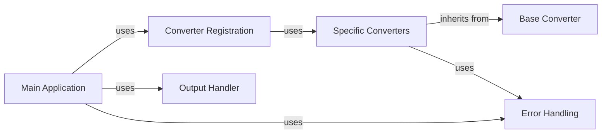

## Component Details

One paragraph explaining the functionality which is represented by this graph. What the main flow is and what is its purpose.

### Main Application
The application's entry point. Parses command-line arguments, initializes the core conversion logic, selects the appropriate converter, handles the conversion process, and manages output. Handles errors gracefully.

**Related Classes/Methods**: _None_

### Converter Registration
Registers available converters and selects the correct one based on the input file type. Uses a registry or mapping of file extensions to converter classes.

**Related Classes/Methods**: _None_

### Base Converter
Abstract base class defining the common interface for all document converters. Ensures consistency in how converters are used. Defines methods like `convert()`.

**Related Classes/Methods**: _None_

### Specific Converters
A family of classes (e.g., `DocxConverter`, `PdfConverter`, `HtmlConverter`), each converting a specific document type. Inherit from `DocumentConverter`.

**Related Classes/Methods**: _None_

### Output Handler
Manages the output of the converted document (writing to file, console, etc.). This functionality is intertwined with the Main Application but can be conceptually separated.

**Related Classes/Methods**: _None_

### Error Handling
Centralized error handling. Catches exceptions during conversion and provides informative error messages. Logs errors for debugging.

**Related Classes/Methods**: _None_

### [FAQ](https://github.com/CodeBoarding/GeneratedOnBoardings/tree/main?tab=readme-ov-file#faq)