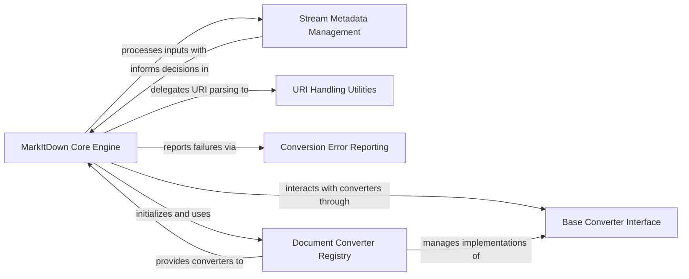

## Component Details

This graph illustrates the core components of the MarkItDown conversion system, focusing on how the central engine orchestrates document conversion by managing converters, handling stream metadata, processing URIs, and reporting errors, all built upon a foundational converter interface.

### MarkItDown Core Engine
The central component responsible for initializing the conversion system, registering built-in and plugin converters, and orchestrating the document conversion process from various sources (local files, streams, URIs, responses). It dispatches conversion tasks to appropriate converters based on priority and stream information.

**Related Classes/Methods**:

- <a href="https://github.com/microsoft/markitdown/blob/master/packages/markitdown/src/markitdown/_markitdown.py#L93-L771" target="_blank" rel="noopener noreferrer">`markitdown.packages.markitdown.src.markitdown._markitdown.MarkItDown` (93:771)</a>
- <a href="https://github.com/microsoft/markitdown/blob/master/packages/markitdown/src/markitdown/_markitdown.py#L97-L130" target="_blank" rel="noopener noreferrer">`markitdown.packages.markitdown.src.markitdown._markitdown.MarkItDown:__init__` (97:130)</a>
- <a href="https://github.com/microsoft/markitdown/blob/master/packages/markitdown/src/markitdown/_markitdown.py#L132-L221" target="_blank" rel="noopener noreferrer">`markitdown.packages.markitdown.src.markitdown._markitdown.MarkItDown:enable_builtins` (132:221)</a>
- <a href="https://github.com/microsoft/markitdown/blob/master/packages/markitdown/src/markitdown/_markitdown.py#L223-L241" target="_blank" rel="noopener noreferrer">`markitdown.packages.markitdown.src.markitdown._markitdown.MarkItDown:enable_plugins` (223:241)</a>
- <a href="https://github.com/microsoft/markitdown/blob/master/packages/markitdown/src/markitdown/_markitdown.py#L243-L291" target="_blank" rel="noopener noreferrer">`markitdown.packages.markitdown.src.markitdown._markitdown.MarkItDown:convert` (243:291)</a>
- <a href="https://github.com/microsoft/markitdown/blob/master/packages/markitdown/src/markitdown/_markitdown.py#L293-L328" target="_blank" rel="noopener noreferrer">`markitdown.packages.markitdown.src.markitdown._markitdown.MarkItDown:convert_local` (293:328)</a>
- <a href="https://github.com/microsoft/markitdown/blob/master/packages/markitdown/src/markitdown/_markitdown.py#L330-L375" target="_blank" rel="noopener noreferrer">`markitdown.packages.markitdown.src.markitdown._markitdown.MarkItDown:convert_stream` (330:375)</a>
- <a href="https://github.com/microsoft/markitdown/blob/master/packages/markitdown/src/markitdown/_markitdown.py#L396-L455" target="_blank" rel="noopener noreferrer">`markitdown.packages.markitdown.src.markitdown._markitdown.MarkItDown:convert_uri` (396:455)</a>
- <a href="https://github.com/microsoft/markitdown/blob/master/packages/markitdown/src/markitdown/_markitdown.py#L457-L527" target="_blank" rel="noopener noreferrer">`markitdown.packages.markitdown.src.markitdown._markitdown.MarkItDown:convert_response` (457:527)</a>
- <a href="https://github.com/microsoft/markitdown/blob/master/packages/markitdown/src/markitdown/_markitdown.py#L529-L619" target="_blank" rel="noopener noreferrer">`markitdown.packages.markitdown.src.markitdown._markitdown.MarkItDown:_convert` (529:619)</a>
- <a href="https://github.com/microsoft/markitdown/blob/master/packages/markitdown/src/markitdown/_markitdown.py#L629-L659" target="_blank" rel="noopener noreferrer">`markitdown.packages.markitdown.src.markitdown._markitdown.MarkItDown:register_converter` (629:659)</a>
- <a href="https://github.com/microsoft/markitdown/blob/master/packages/markitdown/src/markitdown/_markitdown.py#L661-L760" target="_blank" rel="noopener noreferrer">`markitdown.packages.markitdown.src.markitdown._markitdown.MarkItDown:_get_stream_info_guesses` (661:760)</a>
- <a href="https://github.com/microsoft/markitdown/blob/master/packages/markitdown/src/markitdown/_markitdown.py#L762-L771" target="_blank" rel="noopener noreferrer">`markitdown.packages.markitdown.src.markitdown._markitdown.MarkItDown._normalize_charset` (762:771)</a>
- <a href="https://github.com/microsoft/markitdown/blob/master/packages/markitdown/src/markitdown/_markitdown.py#L86-L90" target="_blank" rel="noopener noreferrer">`markitdown.packages.markitdown.src.markitdown._markitdown.ConverterRegistration` (86:90)</a>

### Stream Metadata Management
This component, represented by the StreamInfo dataclass, is responsible for encapsulating and managing metadata associated with input streams, such as MIME type, file extension, character set, filename, local path, and URL. It provides a mechanism to copy and update this information as the stream is processed.

**Related Classes/Methods**:

- <a href="https://github.com/microsoft/markitdown/blob/master/packages/markitdown/src/markitdown/_stream_info.py#L6-L32" target="_blank" rel="noopener noreferrer">`markitdown.packages.markitdown.src.markitdown._stream_info.StreamInfo` (6:32)</a>

### URI Handling Utilities
This component provides utility functions for processing and interpreting different types of Uniform Resource Identifiers (URIs). Its responsibilities include converting file URIs to local file paths and parsing data URIs to extract their content and associated metadata.

**Related Classes/Methods**:

- <a href="https://github.com/microsoft/markitdown/blob/master/packages/markitdown/src/markitdown/_uri_utils.py#L8-L16" target="_blank" rel="noopener noreferrer">`markitdown.packages.markitdown.src.markitdown._uri_utils.file_uri_to_path` (8:16)</a>
- <a href="https://github.com/microsoft/markitdown/blob/master/packages/markitdown/src/markitdown/_uri_utils.py#L19-L52" target="_blank" rel="noopener noreferrer">`markitdown.packages.markitdown.src.markitdown._uri_utils.parse_data_uri` (19:52)</a>

### Conversion Error Reporting
This component defines a set of custom exception classes that are used to report various errors encountered during the document conversion process. These exceptions provide specific details about issues such as missing dependencies, unsupported file formats, and general conversion failures, aiding in error handling and debugging.

**Related Classes/Methods**:

- <a href="https://github.com/microsoft/markitdown/blob/master/packages/markitdown/src/markitdown/_exceptions.py#L11-L16" target="_blank" rel="noopener noreferrer">`markitdown.packages.markitdown.src.markitdown._exceptions.MarkItDownException` (11:16)</a>
- <a href="https://github.com/microsoft/markitdown/blob/master/packages/markitdown/src/markitdown/_exceptions.py#L19-L31" target="_blank" rel="noopener noreferrer">`markitdown.packages.markitdown.src.markitdown._exceptions.MissingDependencyException` (19:31)</a>
- <a href="https://github.com/microsoft/markitdown/blob/master/packages/markitdown/src/markitdown/_exceptions.py#L34-L39" target="_blank" rel="noopener noreferrer">`markitdown.packages.markitdown.src.markitdown._exceptions.UnsupportedFormatException` (34:39)</a>
- <a href="https://github.com/microsoft/markitdown/blob/master/packages/markitdown/src/markitdown/_exceptions.py#L42-L49" target="_blank" rel="noopener noreferrer">`markitdown.packages.markitdown.src.markitdown._exceptions.FailedConversionAttempt` (42:49)</a>
- <a href="https://github.com/microsoft/markitdown/blob/master/packages/markitdown/src/markitdown/_exceptions.py#L52-L76" target="_blank" rel="noopener noreferrer">`markitdown.packages.markitdown.src.markitdown._exceptions.FileConversionException` (52:76)</a>

### Document Converter Registry
This component is responsible for registering and managing the various DocumentConverter implementations. It maintains a prioritized list of converters, allowing the MarkItDown Core Engine to select the most appropriate converter for a given input stream based on its metadata and content.

**Related Classes/Methods**:

- <a href="https://github.com/microsoft/markitdown/blob/master/packages/markitdown/src/markitdown/_markitdown.py#L629-L659" target="_blank" rel="noopener noreferrer">`markitdown.packages.markitdown.src.markitdown._markitdown.MarkItDown.register_converter` (629:659)</a>
- <a href="https://github.com/microsoft/markitdown/blob/master/packages/markitdown/src/markitdown/_markitdown.py#L132-L221" target="_blank" rel="noopener noreferrer">`markitdown.packages.markitdown.src.markitdown._markitdown.MarkItDown.enable_builtins` (132:221)</a>
- <a href="https://github.com/microsoft/markitdown/blob/master/packages/markitdown/src/markitdown/_markitdown.py#L223-L241" target="_blank" rel="noopener noreferrer">`markitdown.packages.markitdown.src.markitdown._markitdown.MarkItDown.enable_plugins` (223:241)</a>
- <a href="https://github.com/microsoft/markitdown/blob/master/packages/markitdown/src/markitdown/_markitdown.py#L86-L90" target="_blank" rel="noopener noreferrer">`markitdown.packages.markitdown.src.markitdown._markitdown.ConverterRegistration` (86:90)</a>

### Base Converter Interface
This component defines the abstract base class or interface that all concrete document converters must implement. It establishes the contract for how converters process input streams and produce Markdown output, ensuring consistency across different conversion types.

**Related Classes/Methods**:

- <a href="https://github.com/microsoft/markitdown/blob/master/packages/markitdown/src/markitdown/_base_converter.py#L42-L105" target="_blank" rel="noopener noreferrer">`markitdown.packages.markitdown.src.markitdown._base_converter.DocumentConverter` (42:105)</a>

### [FAQ](https://github.com/CodeBoarding/GeneratedOnBoardings/tree/main?tab=readme-ov-file#faq)