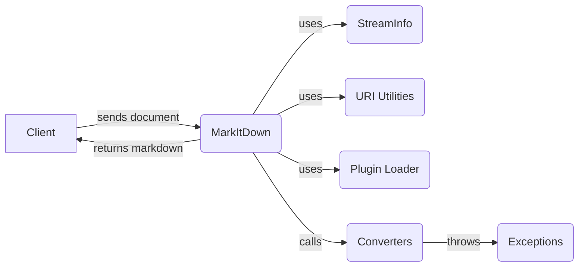

## MarkItDown Core Overview

The `MarkItDown` class is the central component responsible for orchestrating the conversion of various document types into Markdown format. It manages a collection of converters, handles input streams from different sources (local files, URLs, streams, responses), and applies the appropriate conversion logic based on file type detection and user-defined configurations.

## Components

- **Client**: Initiates the conversion process by providing a document (file path, URL, stream, or response) to the `MarkItDown` component.

- **MarkItDown**: Orchestrates the conversion process. It receives the document, determines the appropriate converter based on the input type and content, applies the conversion, and returns the resulting Markdown. It uses `StreamInfo` to determine the file type, `URI Utilities` to handle URI conversions, `Plugin Loader` to load external plugins, and `Converters` to perform the actual conversion. **Relevant source files:** `markitdown._markitdown.MarkItDown`

- **StreamInfo**: Holds information about the input stream, such as mimetype, filename, and encoding. It helps `MarkItDown` in determining the appropriate converter to use. **Relevant source files:** `markitdown._stream_info.StreamInfo`

- **URI Utilities**: Provides utility functions for handling URIs, including converting file URIs to file paths and parsing data URIs. `MarkItDown` uses these utilities to process input sources specified as URIs. **Relevant source files:** `markitdown._uri_utils`

- **Plugin Loader**: Discovers and loads external plugins that extend the functionality of `MarkItDown`. Plugins can provide additional converters or modify the conversion process. `MarkItDown` uses this component during initialization to load available plugins. **Relevant source files:** `markitdown._markitdown._load_plugins`

- **Converters**: A collection of classes, each responsible for converting a specific file format to Markdown. `MarkItDown` calls the appropriate converter based on the file type. If a conversion fails, it throws an exception. **Relevant source files:** `markitdown.converters`

- **Exceptions**: Defines custom exception classes for handling errors during the conversion process. `Converters` throws these exceptions when a conversion fails. **Relevant source files:** `markitdown._exceptions`