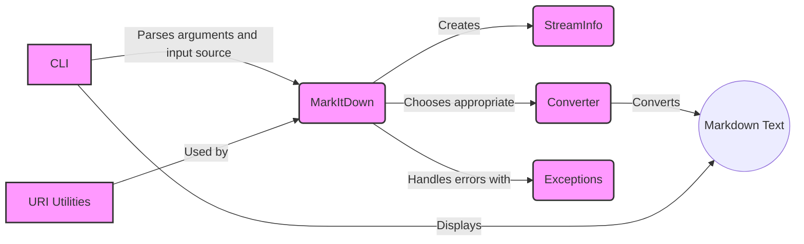

### Component Descriptions:

**1. CLI (Command Line Interface)**
   - *Purpose*: The entry point for the application. It receives user input (source file/URI), parses arguments, and initiates the conversion process by creating a `MarkItDown` instance.
   - *Functionality*: Parses command-line arguments, determines the input source, and calls the `MarkItDown.convert` method.
   - *Interaction*: Receives input from the user and passes it to `MarkItDown`. Displays the final Markdown output to the user.
   - *Relevant source files*: `repos.markitdown.packages.markitdown.src.markitdown.__main__.main`

**2. MarkItDown**
   - *Purpose*: The central class responsible for managing converters, stream information, and the overall conversion process. It orchestrates the conversion of various file types and data sources to Markdown by selecting and applying appropriate converters.
   - *Functionality*: Initializes converters, determines the input type, creates a `StreamInfo` object, selects the appropriate converter, and calls the converter's `convert` method. Handles built-in and plugin converters.
   - *Interaction*: Receives input from `CLI`, creates `StreamInfo`, uses `URIUtils`, selects and calls `Converter`, and handles potential `Exceptions`.
   - *Relevant source files*: `repos.markitdown.packages.markitdown.src.markitdown._markitdown.MarkItDown`

**3. StreamInfo**
   - *Purpose*: A data class that holds information about the input stream, such as filename, mimetype, and encoding. It's used to provide context for the conversion process.
   - *Functionality*: Stores metadata about the input stream, which is used by the converters to handle the input correctly.
   - *Interaction*: Created by `MarkItDown` and passed to `Converter`.
   - *Relevant source files*: `repos.markitdown.packages.markitdown.src.markitdown._stream_info.StreamInfo`

**4. Converter**
   - *Purpose*: Abstract class and concrete implementations for converting specific file formats to Markdown. Each converter handles a specific file type and uses appropriate libraries or methods for the conversion.
   - *Functionality*: Converts a specific file format to Markdown. Uses external libraries or custom logic to extract content and format it as Markdown.
   - *Interaction*: Called by `MarkItDown` with a `StreamInfo` object. Returns the converted Markdown text.
   - *Relevant source files*: `repos.markitdown.packages.markitdown.src.markitdown.converters._plain_text_converter.PlainTextConverter`, `repos.markitdown.packages.markitdown.src.markitdown.converters._zip_converter.ZipConverter`, `repos.markitdown.packages.markitdown.src.markitdown.converters._html_converter.HtmlConverter`, `repos.markitdown.packages.markitdown.src.markitdown.converters._rss_converter.RssConverter`, `repos.markitdown.packages.markitdown.src.markitdown.converters._wikipedia_converter.WikipediaConverter`, `repos.markitdown.packages.markitdown.src.markitdown.converters._youtube_converter.YouTubeConverter`, `repos.markitdown.packages.markitdown.src.markitdown.converters._bing_serp_converter.BingSerpConverter`, `repos.markitdown.packages.markitdown.src.markitdown.converters._docx_converter.DocxConverter`, `repos.markitdown.packages.markitdown.src.markitdown.converters._xlsx_converter.XlsxConverter`, `repos.markitdown.packages.markitdown.src.markitdown.converters._pptx_converter.PptxConverter`, `repos.markitdown.packages.markitdown.src.markitdown.converters._audio_converter.AudioConverter`, `repos.markitdown.packages.markitdown.src.markitdown.converters._image_converter.ImageConverter`, `repos.markitdown.packages.markitdown.src.markitdown.converters._ipynb_converter.IpynbConverter`, `repos.markitdown.packages.markitdown.src.markitdown.converters._pdf_converter.PdfConverter`, `repos.markitdown.packages.markitdown.src.markitdown.converters._outlook_msg_converter.OutlookMsgConverter`, `repos.markitdown.packages.markitdown.src.markitdown.converters._epub_converter.EpubConverter`, `repos.markitdown.packages.markitdown.src.markitdown.converters._csv_converter.CsvConverter`, `repos.markitdown.packages.markitdown.src.markitdown.converters._doc_intel_converter.DocumentIntelligenceConverter`

**5. Exceptions**
   - *Purpose*: Custom exceptions raised during the conversion process, indicating specific errors or unsupported formats. These exceptions provide a structured way to handle errors during conversion.
   - *Functionality*: Represents different error conditions that can occur during the conversion process.
   - *Interaction*: Raised by `MarkItDown` or `Converter` and caught by `MarkItDown` or `CLI`.
   - *Relevant source files*: `repos.markitdown.packages.markitdown.src.markitdown._exceptions.FailedConversionAttempt`, `repos.markitdown.packages.markitdown.src.markitdown._exceptions.FileConversionException`, `repos.markitdown.packages.markitdown.src.markitdown._exceptions.UnsupportedFormatException`

**6. URI Utilities**
   - *Purpose*: Utilities for handling URIs, including converting file URIs to paths and parsing data URIs. These utilities are used to handle different types of input sources.
   - *Functionality*: Provides functions to convert file URIs to local file paths and parse data URIs.
   - *Interaction*: Used by `MarkItDown` to handle URI-based input sources.
   - *Relevant source files*: `repos.markitdown.packages.markitdown.src.markitdown._uri_utils.file_uri_to_path`, `repos.markitdown.packages.markitdown.src.markitdown._uri_utils.parse_data_uri`
