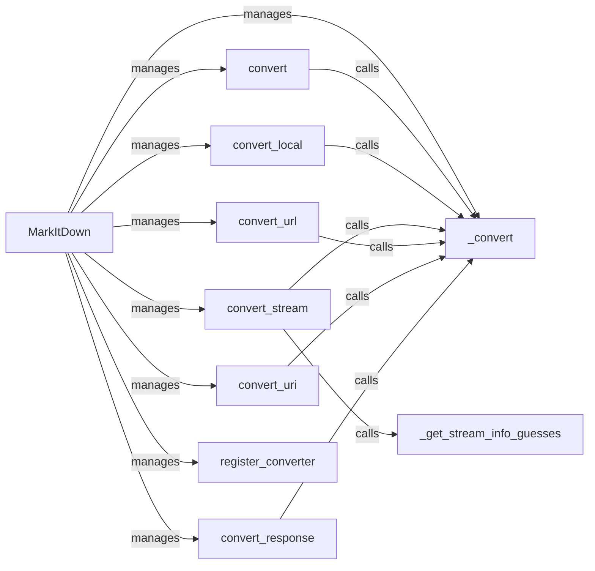

## Component Details

The MarkItDown Core component orchestrates the conversion of various input types (local files, streams, URLs, URIs, responses) into Markdown format. It acts as a central hub, managing converters, enabling built-in converters and plugins, and determining the appropriate converter based on the input stream's information. The core class provides a set of public `convert` methods for different input types, which internally delegate to a private `_convert` method that utilizes registered converters to perform the actual conversion. It also provides functionalities to register new converters and enable built-in or plugin converters.

### MarkItDown
The main class responsible for converting different input types to Markdown. It manages converters, plugins, and built-in functionalities.
- **Related Classes/Methods**: `markitdown.packages.markitdown.src.markitdown._markitdown.MarkItDown`

### convert
The main public method to convert any supported input to Markdown. It determines the input type and calls the appropriate internal conversion method.
- **Related Classes/Methods**: `markitdown.packages.markitdown.src.markitdown._markitdown.MarkItDown:convert`

### convert_local
Converts a local file to Markdown.
- **Related Classes/Methods**: `markitdown.packages.markitdown.src.markitdown._markitdown.MarkItDown:convert_local`

### convert_stream
Converts a stream of data to Markdown.
- **Related Classes/Methods**: `markitdown.packages.markitdown.src.markitdown._markitdown.MarkItDown:convert_stream`

### convert_url
Converts content from a URL to Markdown.
- **Related Classes/Methods**: `markitdown.packages.markitdown.src.markitdown._markitdown.MarkItDown:convert_url`

### convert_uri
Converts content from a URI to Markdown.
- **Related Classes/Methods**: `markitdown.packages.markitdown.src.markitdown._markitdown.MarkItDown:convert_uri`

### convert_response
Converts a response object to Markdown.
- **Related Classes/Methods**: `markitdown.packages.markitdown.src.markitdown._markitdown.MarkItDown:convert_response`

### _convert
The internal method that performs the actual conversion using the registered converters.
- **Related Classes/Methods**: `markitdown.packages.markitdown.src.markitdown._markitdown.MarkItDown:_convert`

### register_converter
Registers a general converter.
- **Related Classes/Methods**: `markitdown.packages.markitdown.src.markitdown._markitdown.MarkItDown:register_converter`

### _get_stream_info_guesses
Guesses the stream information.
- **Related Classes/Methods**: `markitdown.packages.markitdown.src.markitdown._markitdown.MarkItDown:_get_stream_info_guesses`
