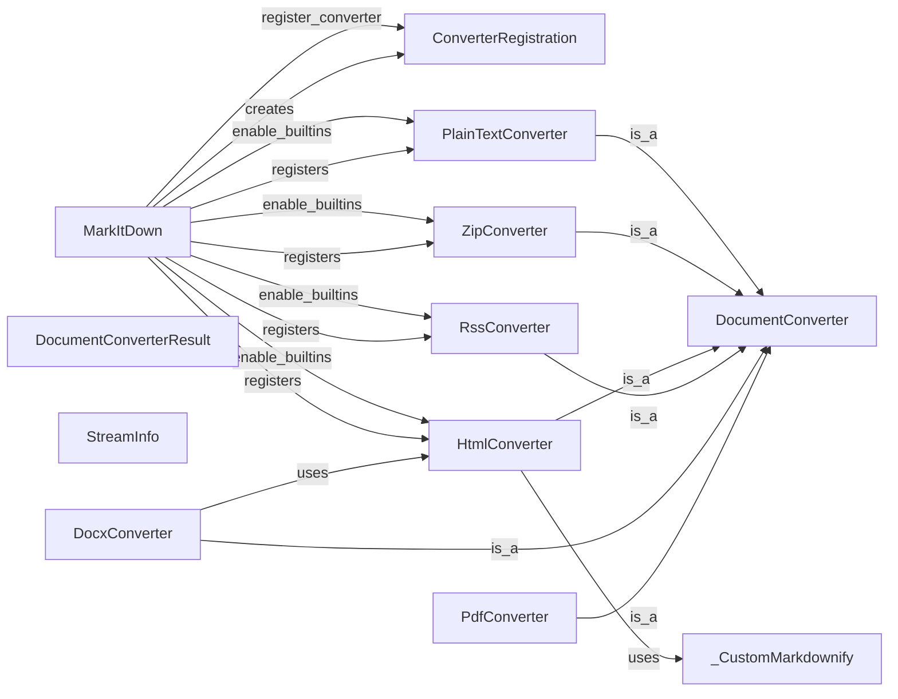

## Component Details

### MarkItDown
Main class responsible for converting various file formats to markdown. It handles converter registration, plugin loading, and the overall conversion process.
- **Related Classes/Methods**: `repos.markitdown.packages.markitdown.src.markitdown._markitdown.MarkItDown`

### ConverterRegistration
Data class for registering converters with their associated file types and conversion functions.
- **Related Classes/Methods**: `repos.markitdown.packages.markitdown.src.markitdown._markitdown.ConverterRegistration`

### DocumentConverter
Base class for converters, defining the interface for converting documents to markdown.
- **Related Classes/Methods**: `repos.markitdown.packages.markitdown.src.markitdown._base_converter.DocumentConverter`

### DocumentConverterResult
Data class representing the result of a document conversion, including the markdown content and any extracted metadata.
- **Related Classes/Methods**: `repos.markitdown.packages.markitdown.src.markitdown._base_converter.DocumentConverterResult`

### StreamInfo
Data class holding information about a stream, such as its extension, filename, mimetype, and URL.
- **Related Classes/Methods**: `repos.markitdown.packages.markitdown.src.markitdown._stream_info.StreamInfo`

### PlainTextConverter
Converter for plain text files.
- **Related Classes/Methods**: `repos.markitdown.packages.markitdown.src.markitdown.converters._plain_text_converter.PlainTextConverter`

### ZipConverter
Converter for zip files.
- **Related Classes/Methods**: `repos.markitdown.packages.markitdown.src.markitdown.converters._zip_converter.ZipConverter`

### HtmlConverter
Converter for HTML files.
- **Related Classes/Methods**: `repos.markitdown.packages.markitdown.src.markitdown.converters._html_converter.HtmlConverter`

### RssConverter
Converter for RSS files.
- **Related Classes/Methods**: `repos.markitdown.packages.markitdown.src.markitdown.converters._rss_converter.RssConverter`

### DocxConverter
Converter for DOCX files.
- **Related Classes/Methods**: `repos.markitdown.packages.markitdown.src.markitdown.converters._docx_converter.DocxConverter`

### PdfConverter
Converter for PDF files.
- **Related Classes/Methods**: `repos.markitdown.packages.markitdown.src.markitdown.converters._pdf_converter.PdfConverter`

### _CustomMarkdownify
Custom Markdownify class for converting HTML to Markdown with specific rules.
- **Related Classes/Methods**: `repos.markitdown.packages.markitdown.src.markitdown.converter_utils.docx.math.omml.Pr`
