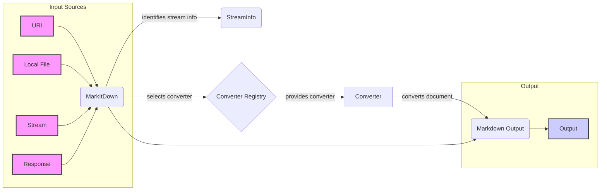

```markdown
## MarkItDown Core Overview

The `MarkItDown` core component orchestrates the conversion of various document types to Markdown. It manages converter registration, stream information handling, and the overall conversion process by selecting and applying appropriate converters.

Here's a data flow diagram illustrating the process:



### Component Descriptions:

*   **URI:** Represents a Uniform Resource Identifier, which serves as an input source for the `MarkItDown` component. It *sends document* to `MarkItDown`.
    *   Relevant source files: `repos.markitdown.packages.markitdown.src.markitdown._markitdown`
*   **Local File:** Represents a file on the local file system, serving as an input source for the `MarkItDown` component. It *sends document* to `MarkItDown`.
    *   Relevant source files: `repos.markitdown.packages.markitdown.src.markitdown._markitdown`
*   **Stream:** Represents an input stream, serving as an input source for the `MarkItDown` component. It *sends document* to `MarkItDown`.
    *   Relevant source files: `repos.markitdown.packages.markitdown.src.markitdown._markitdown`
*   **Response:** Represents a response object (e.g., from a web request), serving as an input source for the `MarkItDown` component. It *sends document* to `MarkItDown`.
    *   Relevant source files: `repos.markitdown.packages.markitdown.src.markitdown._markitdown`
*   **MarkItDown:** The central component that orchestrates the conversion of various document types to Markdown. It manages converter registration, stream information handling, and the overall conversion process by selecting and applying appropriate converters. It *identifies stream info* and *selects converter*.
    *   Relevant source files: `repos.markitdown.packages.markitdown.src.markitdown._markitdown`
*   **StreamInfo:** A data class that holds information about the input stream, such as filename, mimetype, and encoding. It is used to provide context to the converters. `MarkItDown` *uses* `StreamInfo`.
    *   Relevant source files: `repos.markitdown.packages.markitdown.src.markitdown._stream_info`
*   **Converter Registry:** A registry of available converters. `MarkItDown` *uses* this registry to find the appropriate converter for the input document.
    *   Relevant source files: `repos.markitdown.packages.markitdown.src.markitdown._markitdown`
*   **Converter:** An abstract class for converters. Each converter is responsible for converting a specific file format to markdown. It *converts document* to `Markdown Output`.
    *   Relevant source files: `repos.markitdown.packages.markitdown.src.markitdown.converters`
*   **Markdown Output:** The resulting markdown content after the conversion process. It is the *output* of the `Converter` and the `MarkItDown` component.
    *   Relevant source files: `repos.markitdown.packages.markitdown.src.markitdown._markitdown`
*   **Output:** Represents the final output destination for the converted Markdown content. It *receives* the `Markdown Output`.
    *   Relevant source files: `repos.markitdown.packages.markitdown.src.markitdown.__main__`
```