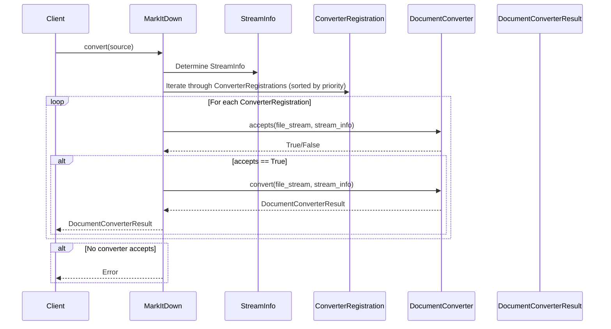
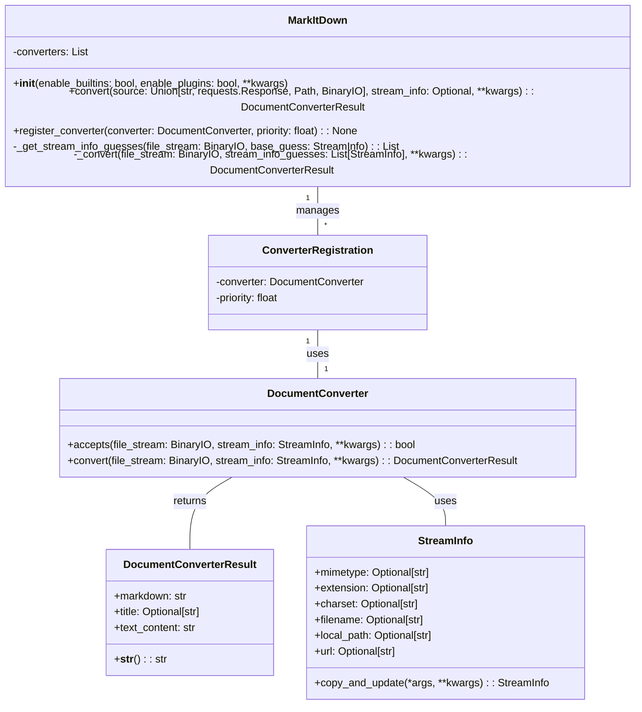

```text
## MarkItDown Component Overview

The `MarkItDown` component is designed to convert various document formats and web content into Markdown. It acts as an orchestrator, managing a collection of `DocumentConverter` instances to handle different file types. The component determines the appropriate converter based on the input stream's metadata (mimetype, extension, etc.) and applies it to generate the Markdown output.

**Main Classes and Their Purposes:**

-   **`MarkItDown`**: The central class responsible for managing the conversion process. It maintains a list of registered `DocumentConverter` instances, determines the appropriate converter for a given input, and orchestrates the conversion.
    -   `__init__`: Initializes the `MarkItDown` instance, registers built-in and plugin converters.
    -   `convert`: Accepts a source (path, URL, stream) and converts it to Markdown using the appropriate converter.
    -   `register_converter`: Registers a `DocumentConverter` with a specific priority.
-   **`DocumentConverter`**: An abstract base class for all document converters. Subclasses implement the `accepts` and `convert` methods to handle specific file types.
    -   `accepts`: Determines whether the converter can handle a given input stream based on its metadata.
    -   `convert`: Converts the input stream to Markdown.
-   **`DocumentConverterResult`**: Represents the result of a document conversion, containing the generated Markdown and an optional title.
-   **`StreamInfo`**: A data class that stores metadata about a file stream, such as mimetype, extension, charset, filename, local path, and URL. This information is used to determine the appropriate converter for the input.
-   **`ConverterRegistration`**: A data class that associates a `DocumentConverter` with a priority.

**Main Flow:**

The main flow of the `MarkItDown` component involves the following steps:

1.  The client calls the `convert` method of the `MarkItDown` class, providing the source document (e.g., file path, URL, or stream).
2.  `MarkItDown` determines the `StreamInfo` of the source.
3.  `MarkItDown` iterates through the registered `ConverterRegistration` instances, sorted by priority.
4.  For each `ConverterRegistration`, it calls the `accepts` method of the associated `DocumentConverter` to check if it can handle the input.
5.  If a converter accepts the input, its `convert` method is called to generate the Markdown output.
6.  The `convert` method returns a `DocumentConverterResult` object containing the Markdown and optional title.



**Main Structure:**

The `MarkItDown` component's structure is centered around the `MarkItDown` class, which manages a collection of `DocumentConverter` instances. The `StreamInfo` class provides metadata about the input stream, which is used to determine the appropriate converter.

