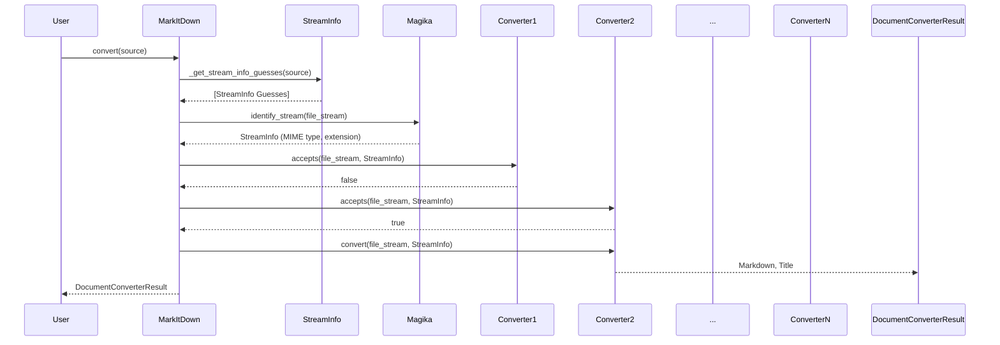
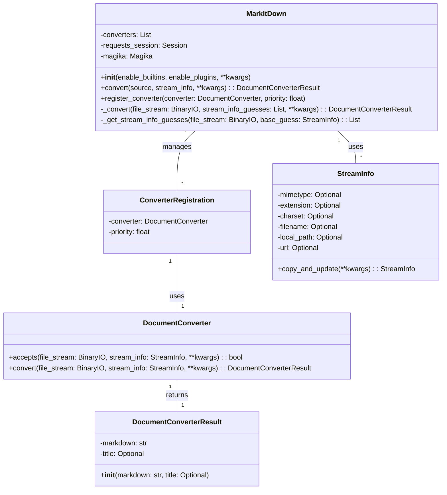

Okay, I have examined the source code of the core components. Here's a refined understanding of the `MarkItDown Orchestrator` component:

**Component Description:**

The `MarkItDown Orchestrator` component, primarily embodied by the `MarkItDown` class, is responsible for converting various document types and web resources into Markdown format. It achieves this through a flexible system of `DocumentConverter` plugins. The core functionality includes converter registration, content type detection, and the conversion process itself.

**Main Classes and Their Purposes:**

*   **`MarkItDown`**: This is the central orchestrator. It manages the registered converters, handles input from various sources (local files, URLs, streams, responses), determines the appropriate converter for a given document, and executes the conversion.
    *   `__init__`: Initializes the `MarkItDown` instance, registers built-in and plugin converters.
    *   `convert`: The main entry point for converting a document. It accepts a source (path, URL, stream, etc.) and dispatches the conversion to the appropriate converter.
    *   `register_converter`: Registers a `DocumentConverter` with a specific priority.
    *   `_convert`: Iterates through the registered converters, attempting to convert the input stream using each one until a successful conversion occurs. It also handles fallback mechanisms and exception management.
*   **`ConverterRegistration`**: A simple data class that associates a `DocumentConverter` with a priority. This is used internally by `MarkItDown` to manage the order in which converters are tried.
*   **`DocumentConverter`**: An abstract base class for all document converters. Subclasses must implement the `accepts` and `convert` methods.
    *   `accepts`: Determines whether the converter can handle a given input stream based on its metadata (`StreamInfo`).
    *   `convert`: Performs the actual conversion of the input stream to Markdown.
*   **`DocumentConverterResult`**: A data class that encapsulates the result of a document conversion, including the Markdown content and an optional title.
*   **`StreamInfo`**: A data class that holds metadata about the input stream, such as MIME type, file extension, character set, filename, and URL. This information is used by converters to determine if they can handle the input and to perform the conversion.

**Main Flow (Sequence Diagram):**

**Class Diagram:**

**Onboarding Document:**

Welcome to the `MarkItDown Orchestrator` component! This component is the heart of the document conversion process, transforming various file types and web resources into Markdown.

The `MarkItDown` class is the central point of interaction. To convert a document, you simply call the `convert` method with the document's source (e.g., file path, URL, or stream). The `MarkItDown` class then uses a chain of responsibility pattern, iterating through registered `DocumentConverter` plugins to find one that can handle the input.

Each `DocumentConverter` is responsible for determining if it can handle a given document (using the `accepts` method) and then performing the actual conversion (using the `convert` method). The `StreamInfo` class provides metadata about the input stream to aid in this process.

To extend the component's functionality, you can create your own `DocumentConverter` plugins and register them with the `MarkItDown` instance using the `register_converter` method. The priority of the converter determines the order in which it is tried during the conversion process.