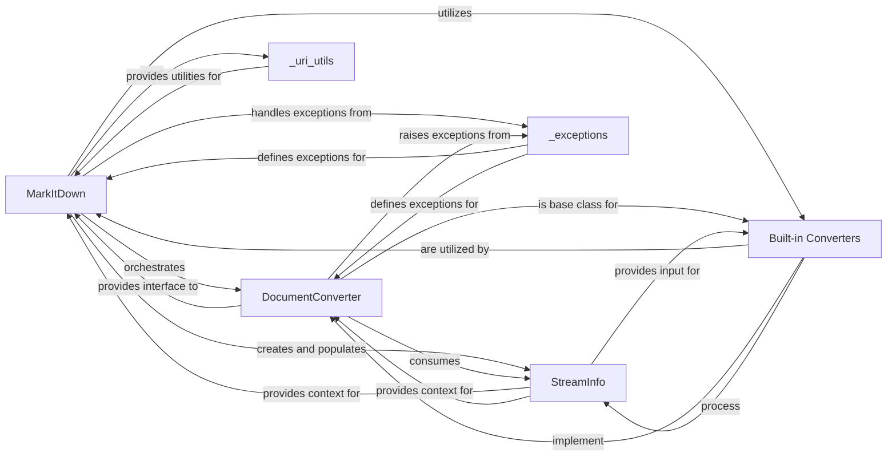

## Component Details

Component overview for the `markitdown` library, focusing on core components and their interactions.

### MarkItDown
The central orchestrator and primary interface of the `markitdown` library. It is responsible for initializing the conversion environment, discovering and registering all available `DocumentConverter` instances (both built-in and plugin-based), and dispatching conversion requests based on the input source type. It manages the `requests` session for network operations and utilizes `magika` for robust file type identification.

**Related Classes/Methods**:

- <a href="https://github.com/microsoft/markitdown/blob/master/packages/markitdown/src/markitdown/_markitdown.py#L92-L770" target="_blank" rel="noopener noreferrer">`markitdown._markitdown.MarkItDown` (92:770)</a>

### DocumentConverter
This is the abstract base class (`ABC`) that defines the contract for all document converters within the `markitdown` ecosystem. It mandates the implementation of key methods: `accepts(stream_info: StreamInfo)` to determine if a converter can process a given input stream, and `convert(stream_info: StreamInfo)` to perform the actual conversion, returning a `DocumentConverterResult`.

**Related Classes/Methods**:

- <a href="https://github.com/microsoft/markitdown/blob/master/packages/markitdown/src/markitdown/_base_converter.py#L41-L104" target="_blank" rel="noopener noreferrer">`markitdown._base_converter.DocumentConverter` (41:104)</a>

### StreamInfo
A crucial data class designed to encapsulate comprehensive metadata about an input document stream. This includes properties such as mimetype, charset, filename, file extension, local file path, and URL. `StreamInfo` objects are vital for providing context to `DocumentConverter` instances, enabling them to make informed decisions about how to process and convert the input data.

**Related Classes/Methods**:

- <a href="https://github.com/microsoft/markitdown/blob/master/packages/markitdown/src/markitdown/_stream_info.py#L5-L31" target="_blank" rel="noopener noreferrer">`markitdown._stream_info.StreamInfo` (5:31)</a>

### Built-in Converters
A comprehensive collection of concrete implementations of the `DocumentConverter` abstract base class. Each converter in this group is specialized to handle a particular file format (e.g., `HtmlConverter`, `PdfConverter`, `DocxConverter`, `PlainTextConverter`, etc.), transforming its content into Markdown. These converters are automatically discovered and registered with the `MarkItDown` instance during its initialization.

**Related Classes/Methods**:

- <a href="https://github.com/microsoft/markitdown/blob/master/packages/markitdown/src/markitdown/converters/_html_converter.py#L19-L89" target="_blank" rel="noopener noreferrer">`markitdown.converters._html_converter.HtmlConverter` (19:89)</a>
- <a href="https://github.com/microsoft/markitdown/blob/master/packages/markitdown/src/markitdown/converters/_pdf_converter.py#L30-L76" target="_blank" rel="noopener noreferrer">`markitdown.converters._pdf_converter.PdfConverter` (30:76)</a>
- <a href="https://github.com/microsoft/markitdown/blob/master/packages/markitdown/src/markitdown/converters/_docx_converter.py#L27-L79" target="_blank" rel="noopener noreferrer">`markitdown.converters._docx_converter.DocxConverter` (27:79)</a>
- <a href="https://github.com/microsoft/markitdown/blob/master/packages/markitdown/src/markitdown/converters/_plain_text_converter.py#L32-L70" target="_blank" rel="noopener noreferrer">`markitdown.converters._plain_text_converter.PlainTextConverter` (32:70)</a>

### _uri_utils
A utility module providing a set of functions for parsing, validating, and manipulating various types of Uniform Resource Identifiers (URIs), including `file:` and `data:` URIs. This module is crucial for `MarkItDown` to correctly interpret and prepare diverse input sources specified by URIs for the conversion pipeline.

**Related Classes/Methods**:

- <a href="https://github.com/microsoft/markitdown/blob/master/packages/markitdown/src/markitdown/_uri_utils.py#L1-L1" target="_blank" rel="noopener noreferrer">`markitdown._uri_utils` (1:1)</a>

### _exceptions
This module defines custom exception classes specific to the `markitdown` library, such as `FailedConversionAttempt`, `FileConversionException`, and `UnsupportedFormatException`. These specialized exceptions provide granular and informative error handling throughout the document conversion process, aiding in debugging and providing clear feedback to users.

**Related Classes/Methods**:

- <a href="https://github.com/microsoft/markitdown/blob/master/packages/markitdown/src/markitdown/_exceptions.py#L1-L1" target="_blank" rel="noopener noreferrer">`markitdown._exceptions` (1:1)</a>

### [FAQ](https://github.com/CodeBoarding/GeneratedOnBoardings/tree/main?tab=readme-ov-file#faq)