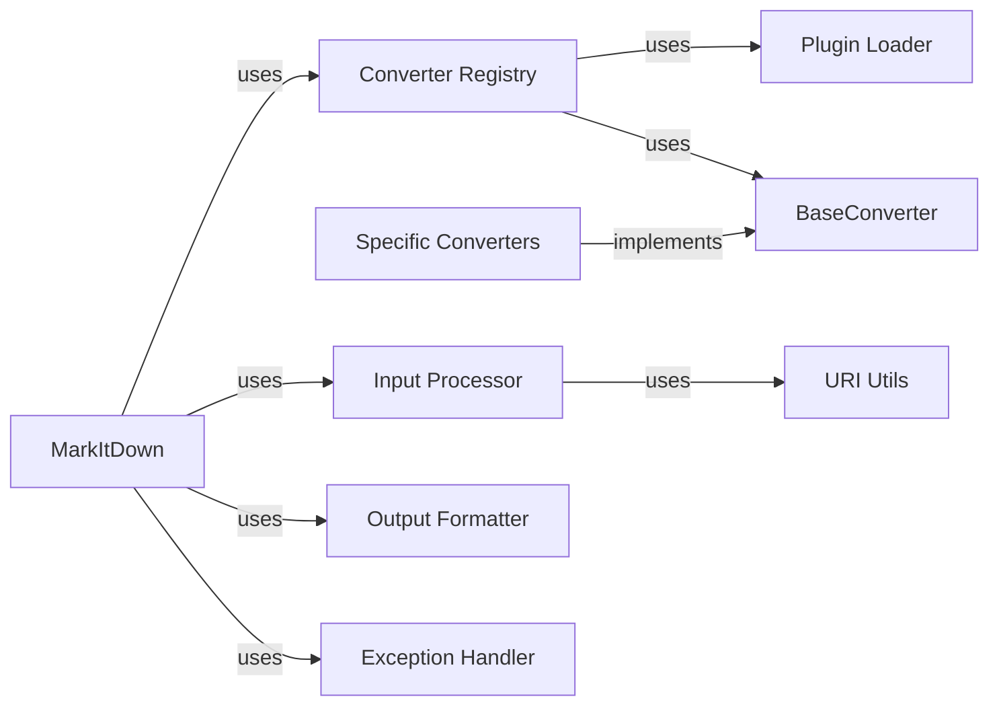

## Component Details

One paragraph explaining the functionality which is represented by this graph. What the main flow is and what is its purpose.

### MarkItDown
The main component, responsible for coordinating the entire conversion process.

**Related Classes/Methods**:

- <a href="https://github.com/microsoft/markitdown/blob/master/packages/markitdown/src/markitdown/_markitdown.py#L92-L770" target="_blank" rel="noopener noreferrer">`packages.markitdown.src.markitdown._markitdown.MarkItDown` (92:770)</a>

### Converter Registry
Manages registered converters.

**Related Classes/Methods**: _None_

### Plugin Loader
Loads and initializes markdown converters from external plugins.

**Related Classes/Methods**: _None_

### Input Processor
Handles various input formats (files, URLs, streams), extracting the raw markdown content.

**Related Classes/Methods**: _None_

### BaseConverter
An abstract base class defining the interface for all specific converters.

**Related Classes/Methods**:

- <a href="https://github.com/microsoft/markitdown/blob/master/packages/markitdown/src/markitdown/_base_converter.py#L1-L100" target="_blank" rel="noopener noreferrer">`packages.markitdown.src.markitdown._base_converter.BaseConverter` (1:100)</a>

### Specific Converters
Concrete implementations of BaseConverter, each handling a specific input or output format.

**Related Classes/Methods**: _None_

### Output Formatter
Formats the converted output into the desired format (e.g., plain text, HTML).

**Related Classes/Methods**: _None_

### Exception Handler
Handles exceptions that may occur during the conversion process, providing informative error messages.

**Related Classes/Methods**:

- <a href="https://github.com/microsoft/markitdown/blob/master/packages/markitdown/src/markitdown/_exceptions.py#L10-L15" target="_blank" rel="noopener noreferrer">`packages.markitdown.src.markitdown._exceptions.MarkItDownException` (10:15)</a>

### URI Utils
Helper functions for processing URIs (if applicable to input handling).

**Related Classes/Methods**:

- <a href="https://github.com/microsoft/markitdown/blob/master/packages/markitdown/src/markitdown/_uri_utils.py#L1-L100" target="_blank" rel="noopener noreferrer">`packages.markitdown.src.markitdown._uri_utils.uri_helper` (1:100)</a>

### [FAQ](https://github.com/CodeBoarding/GeneratedOnBoardings/tree/main?tab=readme-ov-file#faq)