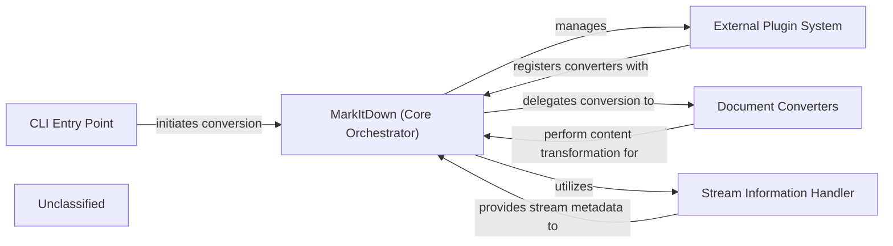

## Details

The MarkItDown library is designed around a central `MarkItDown` orchestrator that manages the conversion of various document types into Markdown. It leverages a flexible plugin system to extend its capabilities with both built-in and external converters. Input streams are first analyzed by a `Stream Information Handler` to determine their characteristics, which then guides the orchestrator in selecting the appropriate `Document Converter`. The entire process can be initiated via a `CLI Entry Point`, providing a user-friendly interface for document conversion.

### MarkItDown (Core Orchestrator)
The central orchestrator and plugin manager of the MarkItDown library. It initializes the system, manages the discovery and registration of built-in and external converters, identifies input file types, fetches external content, and dispatches conversion tasks to the appropriate Document Converters. It acts as a Facade for the entire conversion process, handling the `convert` method which directs the flow based on input source type (local file, URL, stream, or HTTP response).

**Related Classes/Methods**:

- <a href="https://github.com/microsoft/markitdown/blob/main/packages/markitdown/src/markitdown/_markitdown.py#L93-L776" target="_blank" rel="noopener noreferrer">`markitdown._markitdown.MarkItDown`:93-776</a>

### Document Converters [[Expand]](./Document_Converters.md)
A collection of specialized components responsible for the actual content transformation for various document types (e.g., PDF to Markdown, HTML to Markdown). They implement the `DocumentConverter` interface, defining `accepts` and `convert` methods. The Core Orchestrator delegates conversion tasks to these components based on the identified stream information and converter priority.

**Related Classes/Methods**:

- <a href="https://github.com/microsoft/markitdown/blob/main/packages/markitdown/src/markitdown/_base_converter.py#L42-L105" target="_blank" rel="noopener noreferrer">`markitdown._base_converter.DocumentConverter`:42-105</a>
- <a href="https://github.com/microsoft/markitdown/blob/main/packages/markitdown/src/markitdown/converters/_pdf_converter.py#L31-L77" target="_blank" rel="noopener noreferrer">`markitdown.converters._pdf_converter.PdfConverter`:31-77</a>

### External Plugin System
Manages the discovery, loading, and registration of external document converters and other extensions, allowing the MarkItDown library to be highly extensible. The `MarkItDown` orchestrator's `enable_plugins` method is responsible for invoking the plugin loading mechanism, which then registers converters with the orchestrator.

**Related Classes/Methods**:

- <a href="https://github.com/microsoft/markitdown/blob/main/packages/markitdown/src/markitdown/_markitdown.py#L65-L82" target="_blank" rel="noopener noreferrer">`markitdown._markitdown._load_plugins`:65-82</a>

### CLI Entry Point
The command-line interface component that parses user commands, arguments, and options, then initiates the document conversion process by interacting with the `MarkItDown` Core Orchestrator. This is the primary entry point for users interacting with the library from the command line.

**Related Classes/Methods**:

### Stream Information Handler
A utility component responsible for analyzing input data streams (e.g., from files, URLs, or standard input) to gather metadata and make educated guesses about the content type, encoding, and other properties. The `StreamInfo` dataclass encapsulates this metadata, which is crucial for the `MarkItDown` orchestrator in selecting the appropriate `Document Converter`. The `_get_stream_info_guesses` method within the orchestrator utilizes this component.

**Related Classes/Methods**:

- <a href="https://github.com/microsoft/markitdown/blob/main/packages/markitdown/src/markitdown/_stream_info.py#L5-L32" target="_blank" rel="noopener noreferrer">`markitdown._stream_info.StreamInfo`:5-32</a>

### Unclassified
Component for all unclassified files and utility functions (Utility functions/External Libraries/Dependencies)

**Related Classes/Methods**: _None_

### [FAQ](https://github.com/CodeBoarding/GeneratedOnBoardings/tree/main?tab=readme-ov-file#faq)