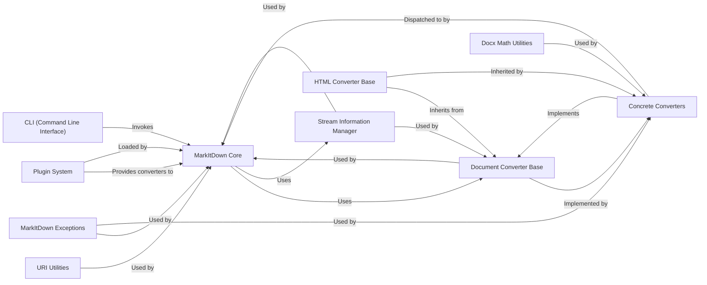

## Details

Component overview for `MarkItDown Core`, including its structure, flow, purpose, and relationships with other fundamental components of the `markitdown` library. These components are fundamental to the `markitdown` library's architecture, chosen because they represent key architectural patterns (Facade, Strategy, Plugin, Utility) essential for a document processing and conversion system.

### MarkItDown Core [[Expand]](./MarkItDown_Core.md)
The central orchestrator and facade for the entire `markitdown` library. It provides a simplified interface for clients to initiate document conversions. Its primary responsibilities include managing the registration of both built-in and plugin-provided document converters, intelligently detecting the input document type using stream information, and dispatching conversion requests to the appropriate concrete converter. It also handles the resolution of various input URIs (e.g., file paths, web URLs).

**Related Classes/Methods**:

- <a href="https://github.com/microsoft/markitdown/blob/main/temp/packages/markitdown/src/markitdown/_markitdown.py#L92-L770" target="_blank" rel="noopener noreferrer">`markitdown._markitdown.MarkItDown` (92:770)</a>

### Document Converter Base
An abstract base class (`DocumentConverter`) that defines the common interface (`accepts` and `convert` methods) for all document converters. This ensures a consistent contract, allowing the `MarkItDown Core` to interact uniformly with various document types.

**Related Classes/Methods**:

- <a href="https://github.com/microsoft/markitdown/blob/main/temp/packages/markitdown/src/markitdown/_base_converter.py#L41-L104" target="_blank" rel="noopener noreferrer">`markitdown._base_converter.DocumentConverter` (41:104)</a>

### Stream Information Manager
Manages and provides detailed information about input streams, primarily for detecting the document's content type (e.g., MIME type, encoding). This component is crucial for the `MarkItDown Core` and individual `Document Converters` to intelligently determine if they can handle a given input.

**Related Classes/Methods**:

- <a href="https://github.com/microsoft/markitdown/blob/main/temp/packages/markitdown/src/markitdown/_stream_info.py#L1-L1" target="_blank" rel="noopener noreferrer">`markitdown._stream_info` (1:1)</a>

### Concrete Converters
A collection of specific implementations of `DocumentConverter` (or `HTML Converter Base`) for various document types (e.g., PDF, DOCX, Image, Audio). Each converter encapsulates the specialized logic required to parse and convert its respective file format into Markdown.

**Related Classes/Methods**:

- `markitdown.converters` (1:1)

### URI Utilities
A utility module responsible for handling various Uniform Resource Identifiers (URIs), enabling the `MarkItDown Core` to process inputs from diverse sources such as local files, web URLs, or data URIs. It provides functions for parsing and resolving these URIs into usable input streams.

**Related Classes/Methods**:

- <a href="https://github.com/microsoft/markitdown/blob/main/temp/packages/markitdown/src/markitdown/_uri_utils.py#L1-L1" target="_blank" rel="noopener noreferrer">`markitdown._uri_utils` (1:1)</a>

### MarkItDown Exceptions
Defines a hierarchy of custom exceptions specific to the `markitdown` library. This provides a consistent and identifiable error handling mechanism across the subsystem, allowing for more granular error reporting and recovery during conversion processes.

**Related Classes/Methods**:

- <a href="https://github.com/microsoft/markitdown/blob/main/temp/packages/markitdown/src/markitdown/_exceptions.py#L1-L1" target="_blank" rel="noopener noreferrer">`markitdown._exceptions` (1:1)</a>

### Plugin System
Represents the mechanism for extending the `markitdown` library with custom converters or functionalities. It allows external modules to register new `DocumentConverter` implementations, enhancing the library's versatility and adaptability to new formats or custom requirements without modifying the core.

**Related Classes/Methods**:

- <a href="https://github.com/microsoft/markitdown/blob/main/temp/packages/markitdown-sample-plugin/src/markitdown_sample_plugin/_plugin.py#L1-L1" target="_blank" rel="noopener noreferrer">`markitdown_sample_plugin._plugin` (1:1)</a>

### HTML Converter Base
An intermediate abstract base class for converters that involve HTML processing as part of their conversion pipeline. It inherits from `DocumentConverter` and provides common logic for handling HTML content, which can be an intermediate representation for formats like DOCX, EPUB, and XLSX.

**Related Classes/Methods**:

- <a href="https://github.com/microsoft/markitdown/blob/main/temp/packages/markitdown/src/markitdown/converters/_html_converter.py#L1-L1" target="_blank" rel="noopener noreferrer">`markitdown.converters._html_converter.HtmlConverterBase` (1:1)</a>

### Docx Math Utilities
A specialized utility module responsible for parsing and converting Office Math Markup Language (OMML) expressions found within DOCX files into LaTeX format. This ensures accurate representation of mathematical content during DOCX conversion.

**Related Classes/Methods**:

- <a href="https://github.com/microsoft/markitdown/blob/main/temp/packages/markitdown/src/markitdown/converter_utils/docx/math/omml.py#L1-L1" target="_blank" rel="noopener noreferrer">`markitdown.converter_utils.docx.math.omml` (1:1)</a>

### CLI (Command Line Interface)
Provides a command-line interface for users to interact with the `MarkItDown` library, enabling document conversions directly from the terminal. It acts as a thin wrapper around the `MarkItDown Core`, parsing arguments and invoking the main conversion logic.

**Related Classes/Methods**:

- <a href="https://github.com/microsoft/markitdown/blob/main/temp/packages/markitdown/src/markitdown/__main__.py#L1-L1" target="_blank" rel="noopener noreferrer">`markitdown.__main__` (1:1)</a>

### [FAQ](https://github.com/CodeBoarding/GeneratedOnBoardings/tree/main?tab=readme-ov-file#faq)