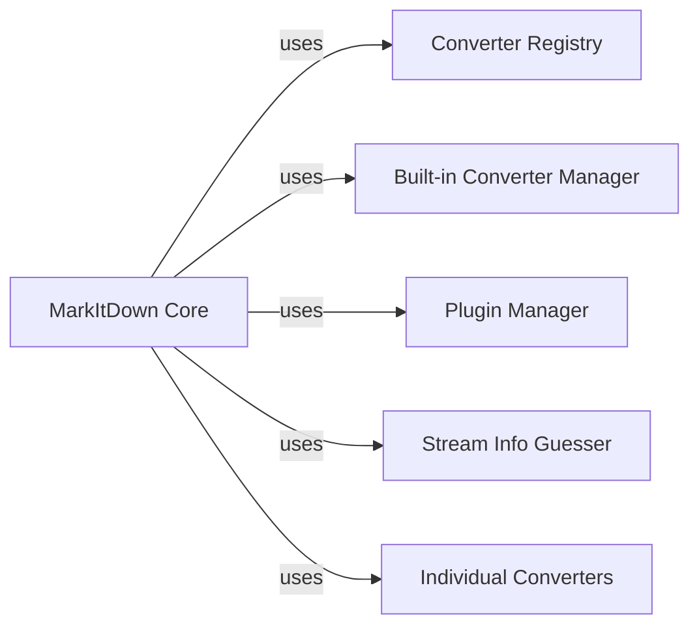

## Component Details

One paragraph explaining the functionality which is represented by this graph. What the main flow is and what is its purpose.

### MarkItDown Core
The main controller. Initializes converters, manages the conversion process, and handles input/output. It acts as a central point of coordination.

**Related Classes/Methods**:

- <a href="https://github.com/microsoft/markitdown/blob/master/packages/markitdown/src/markitdown/_markitdown.py#L92-L770" target="_blank" rel="noopener noreferrer">`markitdown._markitdown.MarkItDown` (92:770)</a>
- <a href="https://github.com/microsoft/markitdown/blob/master/packages/markitdown/src/markitdown/_markitdown.py#L101-L150" target="_blank" rel="noopener noreferrer">`markitdown._markitdown.register_converter` (101:150)</a>

### Converter Registry
A central repository for all available converters (built-in and plugins). Provides a mechanism for registering and retrieving converters based on file type or other criteria.

**Related Classes/Methods**:

- <a href="https://github.com/microsoft/markitdown/blob/master/packages/markitdown/src/markitdown/_markitdown.py#L151-L200" target="_blank" rel="noopener noreferrer">`markitdown._markitdown.MarkItDown.get_converter` (151:200)</a>

### Built-in Converter Manager
Handles the loading and initialization of built-in converters that are bundled with the MarkItDown library.

**Related Classes/Methods**:

- <a href="https://github.com/microsoft/markitdown/blob/master/packages/markitdown/src/markitdown/_markitdown.py#L201-L250" target="_blank" rel="noopener noreferrer">`markitdown._markitdown.MarkItDown._load_builtin_converters` (201:250)</a>

### Plugin Manager
Loads and manages external markdown converters (plugins) from specified locations. Handles plugin discovery, loading, and error handling.

**Related Classes/Methods**:

- <a href="https://github.com/microsoft/markitdown/blob/master/packages/markitdown/src/markitdown/_markitdown.py#L64-L81" target="_blank" rel="noopener noreferrer">`markitdown._markitdown.MarkItDown._load_plugins` (64:81)</a>

### Stream Info Guesser
Analyzes input streams to determine file type, encoding, and other relevant metadata. This information is crucial for selecting the appropriate converter.

**Related Classes/Methods**:

- <a href="https://github.com/microsoft/markitdown/blob/master/packages/markitdown/src/markitdown/_stream_info.py#L1-L50" target="_blank" rel="noopener noreferrer">`markitdown._stream_info.guess_stream_info` (1:50)</a>

### Individual Converters
These are the actual conversion engines. Each converter is responsible for transforming a specific file type into markdown.

**Related Classes/Methods**:

- `markitdown.converters.docx.DocxConverter` (1:100)
- `markitdown.converters.pdf.PdfConverter` (1:100)

### [FAQ](https://github.com/CodeBoarding/GeneratedOnBoardings/tree/main?tab=readme-ov-file#faq)