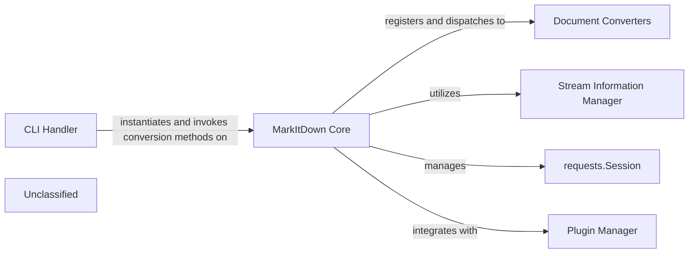

## Details

The `MarkItDown` application is centered around the `MarkItDown Core`, which acts as the primary orchestrator for document conversion. The `CLI Handler` serves as the entry point, parsing user commands and delegating conversion tasks to the `MarkItDown Core`. The `MarkItDown Core` leverages the `Stream Information Manager` to analyze input streams and determine their characteristics, which in turn guides the selection of appropriate `Document Converters`. External content fetching is handled by an internal `requests.Session` managed by the `MarkItDown Core`. Furthermore, the `MarkItDown Core` incorporates a `Plugin Manager` to extend its capabilities by discovering and registering additional converters. This architecture promotes modularity, allowing for flexible input handling and extensible conversion capabilities.

### MarkItDown Core [[Expand]](./MarkItDown_Core.md)
The central processing unit and facade of the application. It manages conversion requests, handles diverse input sources (local files, URIs, streams), directly manages external HTTP/HTTPS requests for fetching web content using an internal `requests` session, orchestrates stream analysis, dispatches conversion tasks to appropriate converters, and manages converter registration (including plugins).

**Related Classes/Methods**:

- <a href="https://github.com/microsoft/markitdown/blob/main/packages/markitdown/src/markitdown/_markitdown.py" target="_blank" rel="noopener noreferrer">`packages.markitdown.src.markitdown._markitdown.MarkItDown`</a>

### Document Converters [[Expand]](./Document_Converters.md)
A component responsible for converting documents based on input stream characteristics. These converters are registered and dispatched by the `MarkItDown Core`. The `DocumentConverter` serves as the abstract base for all specific converters.

**Related Classes/Methods**:

- <a href="https://github.com/microsoft/markitdown/blob/main/packages/markitdown/src/markitdown/_base_converter.py#L42-L105" target="_blank" rel="noopener noreferrer">`markitdown._base_converter.DocumentConverter`:42-105</a>

### Stream Information Manager
A component that analyzes input streams to guess MIME type and charset using tools like `magika` and `charset_normalizer`. This information is crucial for the `MarkItDown Core` to select the correct converter. The `StreamInfo` class encapsulates the results of this analysis.

**Related Classes/Methods**:

- <a href="https://github.com/microsoft/markitdown/blob/main/packages/markitdown/src/markitdown/_stream_info.py#L5-L32" target="_blank" rel="noopener noreferrer">`markitdown._stream_info.StreamInfo`:5-32</a>

### Plugin Manager
A component responsible for discovering and registering external plugins/converters, extending the `MarkItDown` application's capabilities. This functionality is integrated within the `MarkItDown Core`'s registration mechanisms.

**Related Classes/Methods**:

- <a href="https://github.com/microsoft/markitdown/blob/main/packages/markitdown/src/markitdown/_markitdown.py" target="_blank" rel="noopener noreferrer">`packages.markitdown.src.markitdown._markitdown.MarkItDown.register_plugin`</a>

### CLI Handler
A component responsible for handling command-line interface interactions, parsing arguments, and invoking conversion methods on the `MarkItDown Core`.

**Related Classes/Methods**:

- <a href="https://github.com/microsoft/markitdown/blob/main/packages/markitdown/src/markitdown/__main__.py" target="_blank" rel="noopener noreferrer">`markitdown.__main__`</a>

### requests.Session
An internal component managed by `MarkItDown Core` for handling external HTTP/HTTPS requests, primarily for fetching web content from URIs. This is an external library dependency.

**Related Classes/Methods**:

### Unclassified
Component for all unclassified files and utility functions (Utility functions/External Libraries/Dependencies)

**Related Classes/Methods**: _None_

### [FAQ](https://github.com/CodeBoarding/GeneratedOnBoardings/tree/main?tab=readme-ov-file#faq)