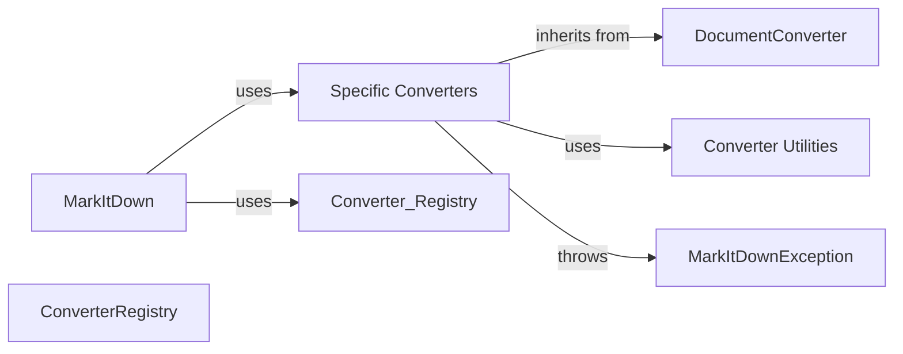

## Component Details

Component overview for the MarkItDown subsystem.

### MarkItDown
The main entry point and orchestrator. Initializes the converter registry, handles plugin loading (if applicable), selects the appropriate converter based on file type, and manages the overall conversion process.

**Related Classes/Methods**:

- <a href="https://github.com/microsoft/markitdown/blob/master/packages/markitdown/src/markitdown/_markitdown.py#L1-L100" target="_blank" rel="noopener noreferrer">`packages/markitdown/src/markitdown/_markitdown.py` (1:100)</a>
- <a href="https://github.com/microsoft/markitdown/blob/master/packages/markitdown/src/markitdown/__main__.py#L1-L50" target="_blank" rel="noopener noreferrer">`packages/markitdown/src/markitdown/__main__.py` (1:50)</a>

### DocumentConverter
Abstract base class defining the interface for all specific document converters. Provides common methods and error handling.

**Related Classes/Methods**:

- <a href="https://github.com/microsoft/markitdown/blob/master/packages/markitdown/src/markitdown/_base_converter.py#L41-L104" target="_blank" rel="noopener noreferrer">`markitdown._base_converter.DocumentConverter` (41:104)</a>

### ConverterRegistry
Manages the registration and lookup of available converters. Acts as a factory for creating converters based on file type or other criteria.

**Related Classes/Methods**:

- <a href="https://github.com/microsoft/markitdown/blob/master/packages/markitdown/src/markitdown/_markitdown.py#L50-L150" target="_blank" rel="noopener noreferrer">`markitdown._markitdown.py` (50:150)</a>

### Specific Converters
A set of concrete converter classes (e.g., `DocxConverter`, `PdfConverter`, `HtmlConverter`) each responsible for converting a specific document type to Markdown. They inherit from `DocumentConverter`.

**Related Classes/Methods**:

- `markitdown.converters.*_converter.py` (1:250)

### MarkItDownException
Base class for custom exceptions within the subsystem, ensuring consistent error handling.

**Related Classes/Methods**:

- <a href="https://github.com/microsoft/markitdown/blob/master/packages/markitdown/src/markitdown/_exceptions.py#L10-L15" target="_blank" rel="noopener noreferrer">`markitdown._exceptions.MarkItDownException` (10:15)</a>

### Converter Utilities
Contains helper functions and classes used by the converters (e.g., for parsing specific document formats).

**Related Classes/Methods**:

- `markitdown.converter_utils.*.py` (1:100)

### [FAQ](https://github.com/CodeBoarding/GeneratedOnBoardings/tree/main?tab=readme-ov-file#faq)