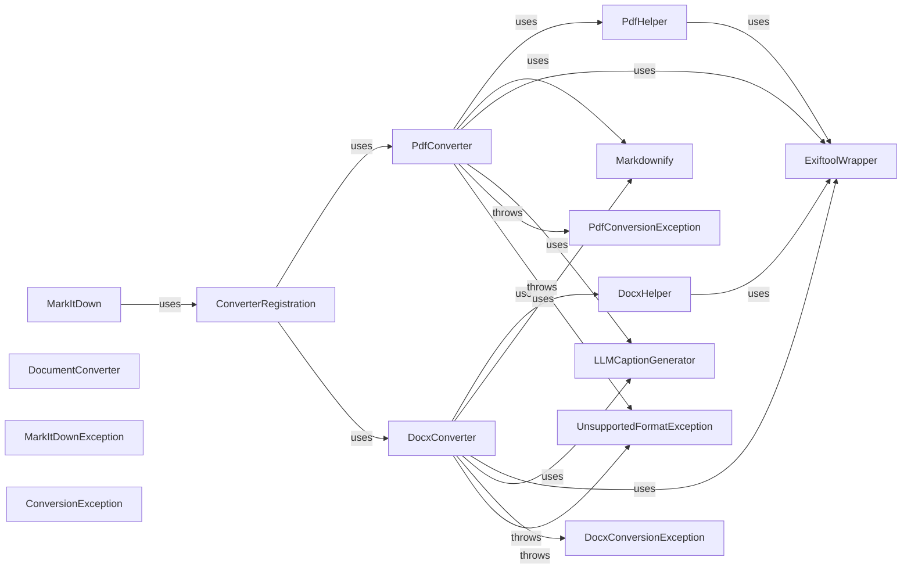

## Component Details

One paragraph explaining the functionality which is represented by this graph. What the main flow is and what is its purpose.

### MarkItDown
Main entry point. Receives document path, determines type, selects appropriate converter, handles exceptions, and outputs Markdown.

**Related Classes/Methods**: _None_

### DocumentConverter
Defines the interface for all converters: `convert(filepath)` returning Markdown string.

**Related Classes/Methods**: _None_

### PdfConverter
Converts PDF to Markdown.

**Related Classes/Methods**: _None_

### DocxConverter
Converts DOCX to Markdown.

**Related Classes/Methods**: _None_

### ConverterRegistration
Registers converters and selects the appropriate one based on file extension.

**Related Classes/Methods**: _None_

### PdfHelper
Encapsulates PDF-specific logic.

**Related Classes/Methods**: _None_

### DocxHelper
Encapsulates DOCX-specific logic.

**Related Classes/Methods**: _None_

### Markdownify
Generates Markdown from processed data.

**Related Classes/Methods**: _None_

### ExiftoolWrapper
Wrapper for exiftool library (optional). Handles metadata extraction.

**Related Classes/Methods**: _None_

### LLMCaptionGenerator
Generates captions using an LLM (optional).

**Related Classes/Methods**: _None_

### MarkItDownException
Base class for all exceptions.

**Related Classes/Methods**: _None_

### ConversionException
Generic conversion error.

**Related Classes/Methods**: _None_

### PdfConversionException
PDF-specific conversion error.

**Related Classes/Methods**: _None_

### DocxConversionException
DOCX-specific conversion error.

**Related Classes/Methods**: _None_

### UnsupportedFormatException
Unsupported file format.

**Related Classes/Methods**: _None_

### [FAQ](https://github.com/CodeBoarding/GeneratedOnBoardings/tree/main?tab=readme-ov-file#faq)