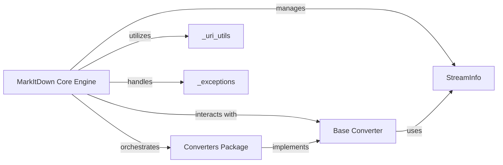

## Component Details

The MarkItDown Core Engine subsystem is the central nervous system of the markitdown library, responsible for orchestrating the entire document conversion process. It acts as the primary interface for initiating conversions, managing input sources, dispatching tasks to specialized converters, and handling errors.

### MarkItDown Core Engine
This is the primary orchestrator of the document conversion process. It initializes the system, registers available document converters (which adhere to the Base Converter interface), identifies the type of input source (local file, URI, stream, HTTP response), and dispatches the conversion request to the appropriate internal method. It also manages the guessing and handling of StreamInfo and oversees the overall flow of conversion attempts and error management using _exceptions.

**Related Classes/Methods**:

- <a href="https://github.com/microsoft/markitdown/blob/master/packages/markitdown/src/markitdown/_markitdown.py#L0-L0" target="_blank" rel="noopener noreferrer">`markitdown._markitdown` (0:0)</a>

### Base Converter
Provides the abstract base class (BaseConverter) for all specific content converters. It defines the common interface and methods that all converters must implement, ensuring consistency in how they are registered and invoked by the MarkItDown Core Engine. It also handles basic StreamInfo management, acting as a foundational contract for all conversion logic.

**Related Classes/Methods**:

- <a href="https://github.com/microsoft/markitdown/blob/master/packages/markitdown/src/markitdown/_base_converter.py#L0-L0" target="_blank" rel="noopener noreferrer">`markitdown._base_converter` (0:0)</a>

### Converters Package
A collection of modules, each implementing specific content conversion logic (e.g., PlainTextConverter, HtmlConverter, DocxConverter, PdfConverter, etc.). These converters inherit from Base Converter and are registered with the MarkItDown Core Engine instance. They are invoked based on the input content's type and desired output, performing the actual transformation.

**Related Classes/Methods**:

- `markitdown.converters` (0:0)

### StreamInfo
A data class used to encapsulate and manage information about the input stream or content being converted, such as content type, charset, and the stream itself. It provides methods for copying and updating this information, which is crucial for the MarkItDown Core Engine to correctly identify and prepare input for converters, and for converters to understand the input context.

**Related Classes/Methods**:

- <a href="https://github.com/microsoft/markitdown/blob/master/packages/markitdown/src/markitdown/_stream_info.py#L0-L0" target="_blank" rel="noopener noreferrer">`markitdown._stream_info` (0:0)</a>

### _uri_utils
A utility module providing functions for handling and parsing URIs, including converting file URIs to local paths and parsing data URIs. This is essential for the MarkItDown Core Engine to handle various network and local file inputs, ensuring it can correctly resolve and access the content to be converted.

**Related Classes/Methods**:

- <a href="https://github.com/microsoft/markitdown/blob/master/packages/markitdown/src/markitdown/_uri_utils.py#L0-L0" target="_blank" rel="noopener noreferrer">`markitdown._uri_utils` (0:0)</a>

### _exceptions
Defines custom exception classes specific to the markitdown library, such as FailedConversionAttempt, FileConversionException, and UnsupportedFormatException. These are used to provide specific error handling during the conversion process, allowing for more granular and informative error reporting back to the MarkItDown Core Engine and ultimately to the user.

**Related Classes/Methods**:

- <a href="https://github.com/microsoft/markitdown/blob/master/packages/markitdown/src/markitdown/_exceptions.py#L0-L0" target="_blank" rel="noopener noreferrer">`markitdown._exceptions` (0:0)</a>

### [FAQ](https://github.com/CodeBoarding/GeneratedOnBoardings/tree/main?tab=readme-ov-file#faq)