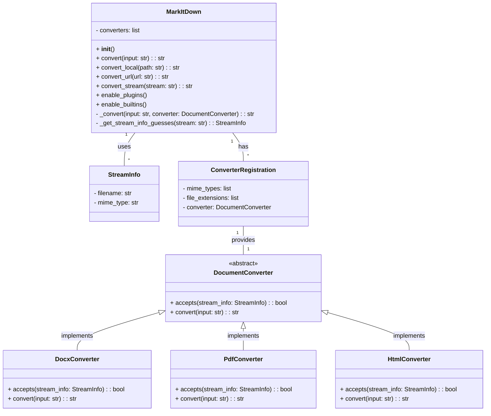

Based on the provided information and the source code access, here's an overview of the `MarkItDown` component:

**Description:**

The `MarkItDown` component is responsible for converting various file formats (e.g., docx, pdf, html) into Markdown. It acts as an orchestrator, utilizing a collection of specialized converters and utility functions to achieve this. The core of the component is the `MarkItDown` class, which handles the overall conversion process, including input handling (local files, URLs, streams), converter selection, plugin management, and output generation.

**Main Classes and Their Purposes:**

*   **`MarkItDown`**: The central class. It initializes the conversion environment, loads plugins and built-in converters, and provides the main `convert` method to trigger the conversion process. It handles different input types (local files, URLs, streams, responses) and delegates the actual conversion to the appropriate converter.
*   **`DocumentConverter`**: An abstract base class for all specific file format converters. It defines the interface that all converters must implement, including `accepts` (to determine if the converter can handle a given input) and `convert` (to perform the actual conversion).
*   **`[Specific Converters]`** (e.g., `DocxConverter`, `PdfConverter`, `HtmlConverter`): Concrete implementations of `DocumentConverter` for specific file formats. Each converter contains the logic to extract content from its respective format and transform it into Markdown.
*   **`StreamInfo`**: A data class to store information about the input stream, such as file name and MIME type. This information is used to select the appropriate converter.
*   **`ConverterRegistration`**: A data class for registering converters, containing information like MIME types, file extensions, and the converter class itself.

**Visualization:**

A class diagram best represents the structure of the `MarkItDown` component, highlighting the relationships between the main classes.

