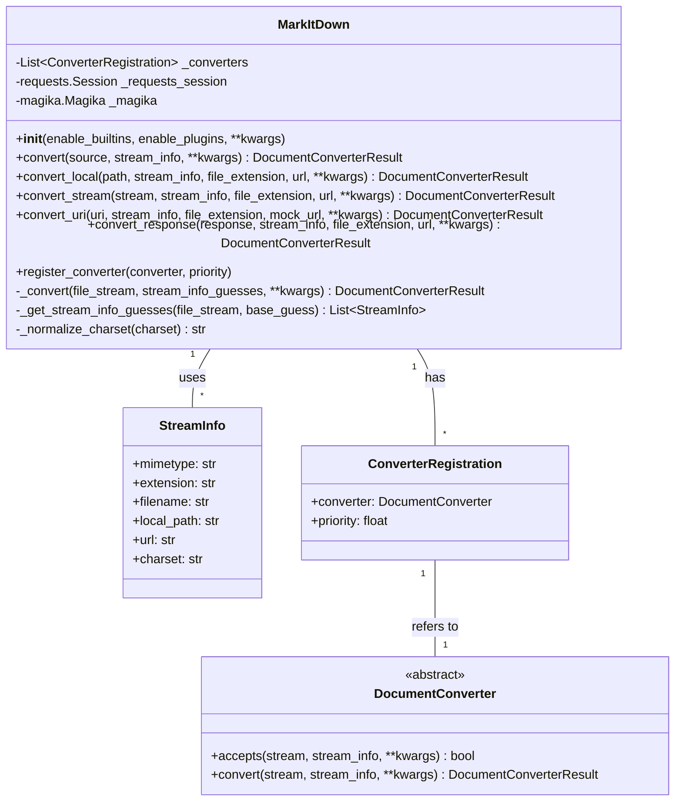

Based on the code analysis, here's an overview of the `Markdown Conversion Orchestration` component:

**1. Description:**

The `Markdown Conversion Orchestration` component is responsible for converting various document types (e.g., HTML, PDF, DOCX) and web resources (e.g., URLs, YouTube videos) into Markdown format. It handles the entire conversion process, from reading the input source to identifying the file type, selecting an appropriate converter, and producing the final Markdown output.

**2. Main Structure:**

The core of this component is the `MarkItDown` class. It orchestrates the conversion process using a list of registered `DocumentConverter` instances.

*   **`MarkItDown`**:
    *   `__init__`: Initializes the `MarkItDown` object, sets up request session, registers built-in and plugin converters.
    *   `convert`: Accepts a source (path, URL, stream, etc.) and initiates the conversion process. It determines the source type and calls the appropriate conversion method (`convert_local`, `convert_stream`, `convert_uri`, `convert_response`).
    *   `convert_local`: Converts a local file specified by path.
    *   `convert_stream`: Converts a binary stream.
    *   `convert_url`: Converts content from a URL.
    *   `convert_uri`: Converts content from a URI (can be file, data, http, https).
    *   `convert_response`: Converts a `requests.Response` object.
    *   `_convert`: This is the central conversion logic. It iterates through a list of `StreamInfo` guesses and registered converters, attempting to convert the input stream until a successful conversion occurs.
    *   `register_converter`: Registers a `DocumentConverter` with a specific priority.
    *   `_get_stream_info_guesses`: Uses `magika` to guess the stream info (mimetype, extension, charset) based on the stream content.

*   **`DocumentConverter` (Abstract Base Class)**:
    *   `accepts`: (Abstract method) Determines whether the converter can handle the given input stream and stream information.
    *   `convert`: (Abstract method) Converts the input stream to Markdown.

*   **`StreamInfo`**:
    *   A dataclass that holds information about the input stream, such as mimetype, extension, filename, local path, and URL.

*   **`ConverterRegistration`**:
    *   A dataclass that associates a `DocumentConverter` with a priority.

**3. Main Flow (Sequence Diagram):**

```mermaid
sequenceDiagram
    participant User
    participant MarkItDown
    participant StreamInfoGuesser
    participant Converter1
    participant Converter2
    participant ...
    participant ConverterN

    User->>MarkItDown: convert(source)
    MarkItDown->>MarkItDown: convert_*(source)
    MarkItDown->>StreamInfoGuesser: _get_stream_info_guesses(stream)
    StreamInfoGuesser-->>MarkItDown: [StreamInfo1, StreamInfo2, ...]
    loop For each StreamInfo guess
        MarkItDown->>Converter1: accepts(stream, StreamInfo)
        Converter1-->>MarkItDown: false
        MarkItDown->>Converter2: accepts(stream, StreamInfo)
        Converter2-->>MarkItDown: true
        MarkItDown->>Converter2: convert(stream, StreamInfo)
        Converter2-->>MarkItDown: DocumentConverterResult
        MarkItDown-->>User: DocumentConverterResult
        break
    end
    MarkItDown-->>User: Exception (if no converter succeeds)
```

**4. Class Diagram:**



**5. Important Modules/Functions:**

1.  `markitdown._markitdown.MarkItDown`: The main class that orchestrates the conversion process.
2.  `markitdown._markitdown.MarkItDown.convert`: The entry point for converting a document.
3.  `markitdown._markitdown.MarkItDown._convert`: The core conversion logic.
4.  `markitdown._markitdown.MarkItDown._get_stream_info_guesses`:  Guesses the file type using `magika`.
5.  `markitdown._base_converter.DocumentConverter`: Abstract base class for all converters.
6.  `markitdown._stream_info.StreamInfo`: Dataclass for storing stream information.