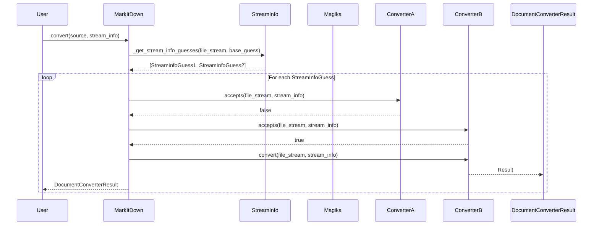
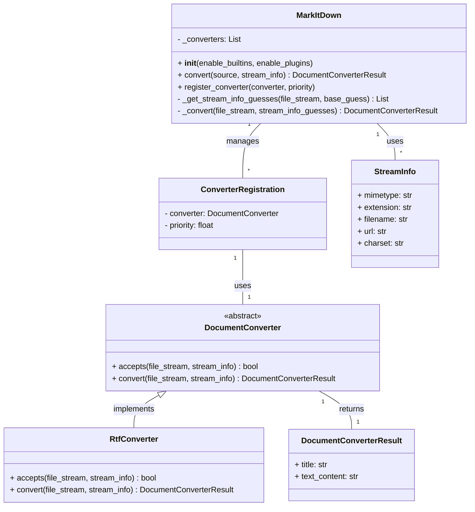

Okay, I have reviewed the source code of the core components. Based on the information gathered, here's a refined overview of the `MarkItDown` component:

**Component Overview: `MarkItDown` - Document Conversion Orchestrator**

The `MarkItDown` component is designed to convert various document formats into Markdown. It acts as an orchestrator, managing the registration and execution of different document converters. The core functionality revolves around identifying the appropriate converter for a given document and then using that converter to produce Markdown output.

**Key Classes and Their Purpose:**

*   **`MarkItDown`**: This is the central class. It maintains a list of registered `DocumentConverter` instances. It handles the overall conversion process, including:
    *   Initializing built-in and plugin converters.
    *   Determining the input type (local file, stream, URL).
    *   Identifying the correct converter based on file type, MIME type, and other stream information.
    *   Executing the selected converter.
    *   Managing fallback mechanisms if a converter fails.
    *   Providing methods for registering new converters (`register_converter`).
*   **`DocumentConverter` (Abstract Class)**: This abstract class defines the interface for all document converters. Concrete converter implementations must inherit from this class and implement the `accepts` and `convert` methods.
    *   `accepts`: Determines if the converter can handle a given document based on its stream information (MIME type, extension, etc.).
    *   `convert`: Performs the actual conversion of the document to Markdown.
*   **`StreamInfo`**: A data class that holds metadata about the input stream, such as MIME type, file extension, filename, and URL. This information is used to determine the appropriate converter to use.
*   **`ConverterRegistration`**: A simple class that associates a `DocumentConverter` with a priority. This allows the `MarkItDown` class to sort the converters and try them in the correct order.
*   **Concrete Converters (e.g., `RtfConverter`, `HtmlConverter`, `DocxConverter`)**: These classes implement the `DocumentConverter` interface and provide the logic for converting specific document formats to Markdown. For example, `RtfConverter` converts RTF files to Markdown using the `striprtf` library.

**Main Flow (Sequence Diagram):**

**Class Diagram:**

**Brief Description:**

The `MarkItDown` component is a document conversion orchestrator. It takes a document in various formats (local file, stream, or URL) and converts it to Markdown. It uses a chain of responsibility pattern, where different `DocumentConverter` implementations are tried until one successfully converts the document. The `StreamInfo` class provides metadata about the input stream, which is used to select the appropriate converter. The `MarkItDown` class manages the registration of converters and the overall conversion process.