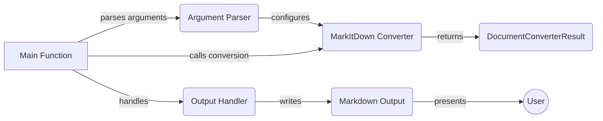

## Markdown Output Component Overview

This component focuses on handling the final Markdown output, directing it to either a file or the console. It's a crucial step in the conversion process, ensuring the user receives the converted content in the desired format.

### Data Flow Diagram

### Component Descriptions

*   **Main Function:** The application's entry point. It orchestrates the conversion process by parsing arguments, initializing the converter, and handling input/output.
    *   **Relevant source files:** `repos.markitdown.packages.markitdown.src.markitdown.__main__.main`

*   **Argument Parser:** Parses command-line arguments to configure the conversion process.
    *   **Relevant source files:** `repos.markitdown.packages.markitdown.src.markitdown.__main__.main`

*   **MarkItDown Converter:** Converts various file formats to Markdown, potentially using Document Intelligence or plugins.
    *   **Relevant source files:** `repos.markitdown.packages.markitdown.src.markitdown.__main__.MarkItDown`, `repos.markitdown.packages.markitdown.src.markitdown._markitdown.MarkItDown`

*   **DocumentConverterResult:** Holds the result of the conversion, including the Markdown content and any errors.
    *   **Relevant source files:** `repos.markitdown.packages.markitdown.src.markitdown.__main__.DocumentConverterResult`, `repos.markitdown.packages.markitdown.src.markitdown._markitdown.DocumentConverterResult`

*   **Output Handler:** Writes the converted Markdown to either a specified file or standard output.
    *   **Relevant source files:** `repos.markitdown.packages.markitdown.src.markitdown.__main__._handle_output`

*   **Markdown Output:** Represents the final output of the conversion process, ready for the user.
    *   **Relevant source files:** `repos.markitdown.packages.markitdown.src.markitdown.__main__._handle_output`

