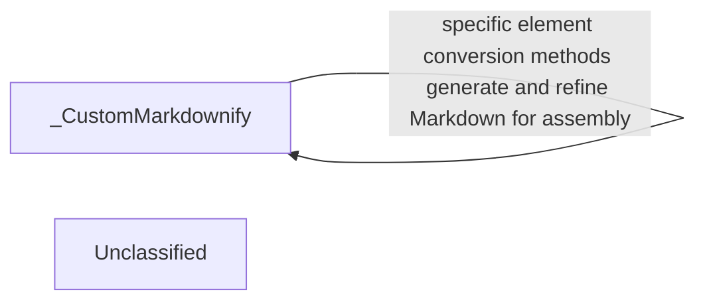

## Details

The _CustomMarkdownify component serves as the central orchestrator for converting HTML content into Markdown. It extends the base MarkdownConverter to provide specialized handling for various HTML elements, ensuring proper Markdown syntax generation, URI escaping, and content sanitization. This component processes the input HTML, applies custom conversion rules, and produces a clean, standardized Markdown output.

### _CustomMarkdownify
This component is a specialized Markdown converter that extends `markdownify.MarkdownConverter`. It orchestrates the entire HTML to Markdown conversion process, encompassing parsing, syntax generation, and content sanitization. It provides custom implementations for handling headings, links, images, and input elements to ensure accurate and clean Markdown output.

**Related Classes/Methods**:

- <a href="https://github.com/microsoft/markitdown/blob/main/packages/markitdown/src/markitdown/converters/_markdownify.py#L8-L126" target="_blank" rel="noopener noreferrer">`packages.markitdown.src.markitdown.converters._markdownify._CustomMarkdownify`:8-126</a>

### Unclassified
Component for all unclassified files and utility functions (Utility functions/External Libraries/Dependencies)

**Related Classes/Methods**: _None_

### [FAQ](https://github.com/CodeBoarding/GeneratedOnBoardings/tree/main?tab=readme-ov-file#faq)