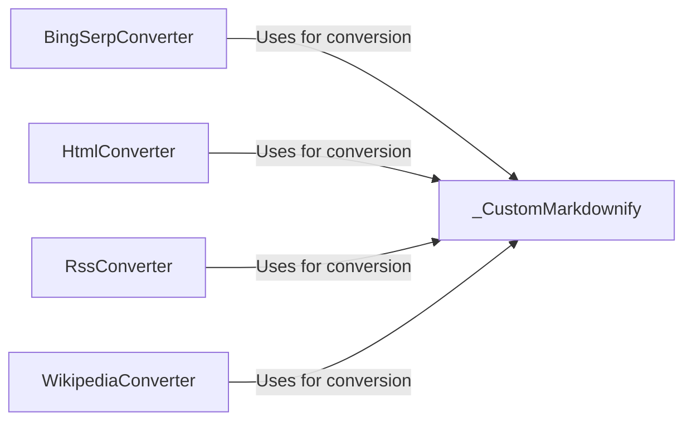

## Component Details

### _CustomMarkdownify
A customized version of Markdownify that handles specific HTML to Markdown conversions, including altering heading styles, removing javascript hyperlinks, truncating large data URIs, and escaping URIs. It inherits from `markdownify.MarkdownConverter` and overrides methods to provide custom conversion logic.
- **Related Classes/Methods**: `repos.markitdown.packages.markitdown.src.markitdown.converters._markdownify._CustomMarkdownify`

### BingSerpConverter
Converts Bing SERP HTML to Markdown using `_CustomMarkdownify` for the core conversion process. It prepares the HTML content and then utilizes the custom Markdownify converter to generate the final Markdown output.
- **Related Classes/Methods**: `repos.markitdown.packages.markitdown.src.markitdown.converters._bing_serp_converter.BingSerpConverter:convert`

### HtmlConverter
Converts general HTML to Markdown using `_CustomMarkdownify`. It serves as a general-purpose converter for various HTML structures, leveraging the custom Markdownify converter for consistent and tailored Markdown output.
- **Related Classes/Methods**: `repos.markitdown.packages.markitdown.src.markitdown.converters._html_converter.HtmlConverter:convert`

### RssConverter
Converts RSS feed content to Markdown, extracting relevant information and using `_CustomMarkdownify` to convert HTML content within the RSS feed to Markdown. It focuses on parsing the RSS feed and converting the content within it.
- **Related Classes/Methods**: `repos.markitdown.packages.markitdown.src.markitdown.converters._rss_converter.RssConverter:_parse_content`

### WikipediaConverter
Converts Wikipedia HTML to Markdown using `_CustomMarkdownify`. It is tailored for Wikipedia's specific HTML structure, ensuring accurate and readable Markdown output from Wikipedia articles.
- **Related Classes/Methods**: `repos.markitdown.packages.markitdown.src.markitdown.converters._wikipedia_converter.WikipediaConverter:convert`
