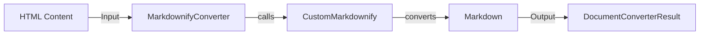

## Markdownify Component Overview

The `MarkdownifyConverter` component is responsible for converting HTML content into Markdown format. It leverages the `_CustomMarkdownify` class, which extends the base `markdownify.MarkdownConverter` to provide custom behavior such as handling heading styles, removing JavaScript links, truncating large data URIs in images, and ensuring proper URI escaping.

**Component Details:**

*   **MarkdownifyConverter**
    *   **Description**: Converts HTML to Markdown using a custom Markdownify implementation.
    *   **Functionality**: This component receives HTML content and uses the `_CustomMarkdownify` class to perform the conversion. It acts as a wrapper around the custom Markdownify converter.
    *   **Interactions**: Receives HTML content as input and outputs Markdown content. It utilizes the `_CustomMarkdownify` class for the actual conversion process.
    *   **Relevant Source Files**:
        *   `repos.markitdown.packages.markitdown.src.markitdown.converters._markdownify`

*   **CustomMarkdownify**
    *   **Description**: A custom implementation of `markdownify.MarkdownConverter` with specific modifications for handling different HTML elements and attributes.
    *   **Functionality**: This class overrides methods from the base `MarkdownConverter` to customize the conversion process. It handles headings, links, images, and other HTML elements according to the specified options.
    *   **Interactions**: Receives HTML elements from the `MarkdownifyConverter` and converts them into Markdown format. It interacts with the `markdownify` library for the base conversion functionality.
    *   **Relevant Source Files**:
        *   `repos.markitdown.packages.markitdown.src.markitdown.converters._markdownify._CustomMarkdownify`

*   **DocumentConverterResult**
    *   **Description**: Represents the result of a document conversion, containing the converted markdown.
    *   **Functionality**: This component encapsulates the converted Markdown content.
    *   **Interactions**: Receives Markdown from `CustomMarkdownify` and encapsulates it.
    *   **Relevant Source Files**:
        *    `repos.markitdown.packages.markitdown.src.markitdown._base_converter.DocumentConverterResult`
