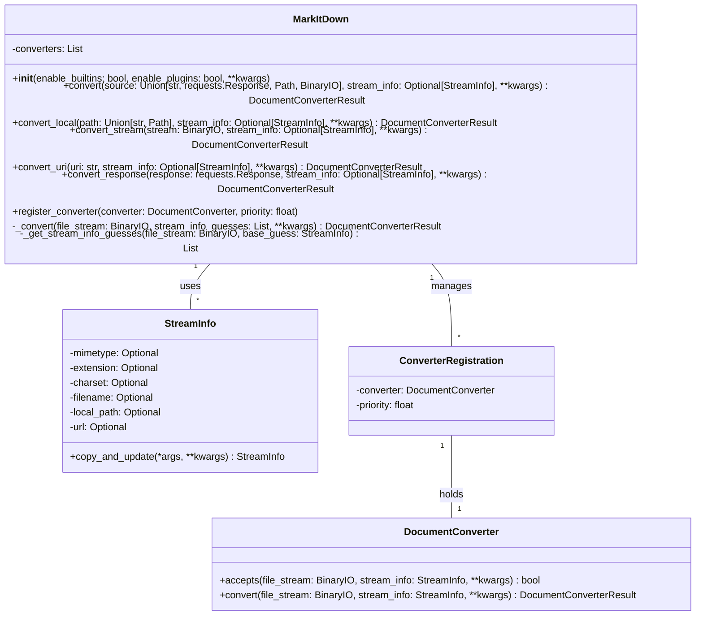

Okay, I have examined the source code for the core components: `MarkItDown`, `DocumentConverter`, `StreamInfo`, and `ConverterRegistration`. Now I can provide a more detailed overview of the component.

**Component Description:**

The `markitdown` component is designed to convert various document formats into Markdown. The core class, `MarkItDown`, orchestrates this process by managing a collection of `DocumentConverter` instances. These converters are responsible for handling specific file types. The `StreamInfo` data class stores metadata about the input stream, such as MIME type, file extension, and URL, which helps in selecting the appropriate converter. The `ConverterRegistration` data class associates a `DocumentConverter` with a priority, influencing the order in which converters are attempted.

**Main Classes and Their Purposes:**

*   **`MarkItDown`**: The central class that manages the conversion process. It initializes and registers converters (both built-in and plugins), handles different input types (local files, streams, URLs, responses), and selects the appropriate converter based on the input's `StreamInfo`.
*   **`DocumentConverter`**: An abstract base class that defines the interface for all converters. Subclasses must implement the `accepts()` method to determine if they can handle a given input and the `convert()` method to perform the actual conversion.
*   **`StreamInfo`**: A data class that encapsulates metadata about the input stream. It stores information like MIME type, file extension, filename, local path, and URL. This information is used to select the appropriate converter and provide context for the conversion process.
*   **`ConverterRegistration`**: A data class that associates a `DocumentConverter` with a priority. This allows the `MarkItDown` class to sort the converters and try them in the correct order.

**Visualization:**

I will use a class diagram to represent the structure of the component, highlighting the relationships between the main classes.

