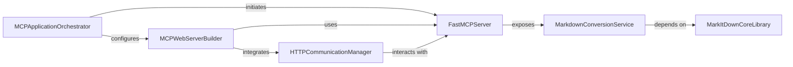

## Component Details

The Markitdown Command Processor (MCP) is a command-line application that serves as a wrapper for the MarkItDown core engine. It provides functionalities for document conversion from various URI types into Markdown. The MCP can operate in two primary modes: a standard command-line interface (STDIO) or an HTTP/SSE server, enabling real-time updates and streamable HTTP communication. Its main purpose is to expose MarkItDown's conversion capabilities as a robust and flexible service.

### MCPApplicationOrchestrator
This component serves as the primary entry point for the MarkItDown Command Processor (MCP) application. It is responsible for parsing command-line arguments to determine the operational mode (either a standard command-line interface or an HTTP/SSE server) and subsequently initiating the appropriate server or command execution flow.

**Related Classes/Methods**:

- <a href="https://github.com/microsoft/markitdown/blob/master/packages/markitdown-mcp/src/markitdown_mcp/__main__.py#L82-L123" target="_blank" rel="noopener noreferrer">`markitdown.packages.markitdown-mcp.src.markitdown_mcp.__main__.main` (82:123)</a>

### MarkdownConversionService
This component provides the core functionality for converting various URI types (http:, https:, file:, data:) into Markdown format within the MCP framework. It is exposed as an MCP tool and relies on the MarkItDownCoreLibrary for the actual conversion process, dynamically checking for plugin enablement.

**Related Classes/Methods**:

- <a href="https://github.com/microsoft/markitdown/blob/master/packages/markitdown-mcp/src/markitdown_mcp/__main__.py#L21-L23" target="_blank" rel="noopener noreferrer">`markitdown.packages.markitdown-mcp.src.markitdown_mcp.__main__.convert_to_markdown` (21:23)</a>
- <a href="https://github.com/microsoft/markitdown/blob/master/packages/markitdown-mcp/src/markitdown_mcp/__main__.py#L26-L31" target="_blank" rel="noopener noreferrer">`markitdown.packages.markitdown-mcp.src.markitdown_mcp.__main__.check_plugins_enabled` (26:31)</a>

### MarkItDownCoreLibrary
This component represents the fundamental MarkItDown library, encapsulating the core logic for processing and converting diverse URI types into Markdown. It serves as the underlying conversion engine utilized by the MarkdownConversionService.

**Related Classes/Methods**:

- `markitdown.MarkItDown` (full file reference)
- `markitdown.MarkItDown.convert_uri` (full file reference)

### MCPWebServerBuilder
This component is responsible for constructing and configuring the Starlette web application instance for the MarkItDown MCP. It defines the necessary routes for Server-Sent Events (SSE) and Streamable HTTP communication, and manages the application's lifecycle, including session management.

**Related Classes/Methods**:

- <a href="https://github.com/microsoft/markitdown/blob/master/packages/markitdown-mcp/src/markitdown_mcp/__main__.py#L34-L78" target="_blank" rel="noopener noreferrer">`markitdown.packages.markitdown-mcp.src.markitdown_mcp.__main__.create_starlette_app` (34:78)</a>

### FastMCPServer
This component represents the core server instance of the MarkItDown Command Processor (MCP). It is responsible for managing the registration and execution of MCP tools, such as the MarkdownConversionService, and handles the underlying communication protocol, whether it's standard input/output (STDIO) or integrated with HTTP/SSE.

**Related Classes/Methods**:

- `mcp.server.fastmcp.FastMCP` (full file reference)
- `mcp.server.Server` (full file reference)
- <a href="https://github.com/microsoft/markitdown/blob/master/packages/markitdown-mcp/src/markitdown_mcp/__main__.py#L16-L16" target="_blank" rel="noopener noreferrer">`markitdown.packages.markitdown-mcp.src.markitdown_mcp.__main__.mcp` (16:16)</a>
- <a href="https://github.com/microsoft/markitdown/blob/master/packages/markitdown-mcp/src/markitdown_mcp/__main__.py#L84-L84" target="_blank" rel="noopener noreferrer">`markitdown.packages.markitdown-mcp.src.markitdown_mcp.__main__.mcp._mcp_server` (84:84)</a>

### HTTPCommunicationManager
This component is dedicated to managing the HTTP-based communication mechanisms for the MCP server when operating in web mode. It specifically handles the implementation of Server-Sent Events (SSE) for real-time updates and Streamable HTTP sessions for request-response interactions.

**Related Classes/Methods**:

- `mcp.server.sse.SseServerTransport` (full file reference)
- `mcp.server.streamable_http_manager.StreamableHTTPSessionManager` (full file reference)
- <a href="https://github.com/microsoft/markitdown/blob/master/packages/markitdown-mcp/src/markitdown_mcp/__main__.py#L44-L52" target="_blank" rel="noopener noreferrer">`markitdown.packages.markitdown-mcp.src.markitdown_mcp.__main__.handle_sse` (44:52)</a>
- <a href="https://github.com/microsoft/markitdown/blob/master/packages/markitdown-mcp/src/markitdown_mcp/__main__.py#L54-L56" target="_blank" rel="noopener noreferrer">`markitdown.packages.markitdown-mcp.src.markitdown_mcp.__main__.handle_streamable_http` (54:56)</a>

### [FAQ](https://github.com/CodeBoarding/GeneratedOnBoardings/tree/main?tab=readme-ov-file#faq)