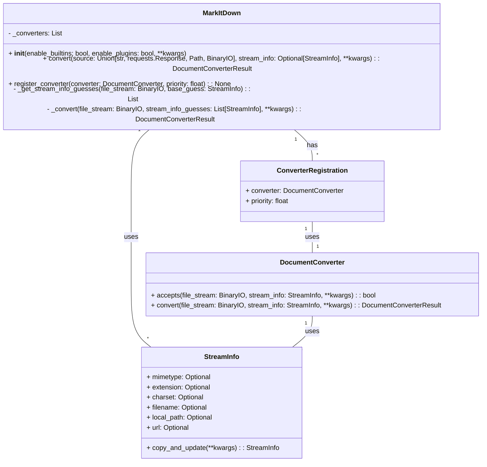

Based on the code analysis, here's a refined overview of the `markitdown` component:

**Description:**

The `markitdown` component is a versatile tool designed to convert various document formats and web resources into Markdown. At its core is the `MarkItDown` class, which orchestrates the conversion process by utilizing a collection of `DocumentConverter` instances. The component intelligently identifies the input type (local file, URL, stream, etc.), determines the appropriate converter, and then executes the conversion. It supports built-in converters for common formats like HTML, DOCX, PDF, and more, and also allows for extending its capabilities through plugins. The `StreamInfo` class plays a crucial role in providing metadata about the input stream, enabling accurate converter selection and processing. The `markitdown.__main__.main` function serves as the entry point for the command-line interface, handling argument parsing and invoking the conversion process.

**Main Classes and Their Purposes:**

*   **`MarkItDown`**: The central class responsible for managing converters, handling different input types (local files, URLs, streams), and orchestrating the conversion process. It uses `magika` to identify the stream type.
*   **`DocumentConverter`**: An abstract base class that defines the interface for all document converters. Subclasses implement the `accepts` method to determine if they can handle a given input and the `convert` method to perform the actual conversion.
*   **`StreamInfo`**: A data class that encapsulates metadata about the input stream, such as MIME type, file extension, and charset. This information is used to select the appropriate converter and handle the input correctly.
*   **`ConverterRegistration`**: A data class that associates a `DocumentConverter` with a priority, influencing the order in which converters are tried.
*   **`markitdown.__main__.main`**: Entry point for the command-line interface. Parses arguments, initializes `MarkItDown`, and performs the conversion.

**Visualization:**

A class diagram effectively represents the structure and relationships between the main classes in the `markitdown` component.

