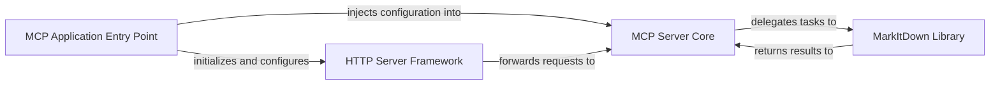

## Details

The MarkItDown Conversion Platform (MCP) operates as a server-side application designed to convert various document formats to Markdown. The `MCP Application Entry Point` (`markitdown_mcp.__main__`) initializes the system, parsing command-line arguments to determine the server's operational mode (HTTP/SSE or standard I/O). If HTTP/SSE is chosen, it sets up the `HTTP Server Framework` using Starlette and Uvicorn to handle incoming web requests. The `HTTP Server Framework` then routes these requests to the `MCP Server Core` (`mcp.server.fastmcp.FastMCP` and `mcp.server.Server`), which encapsulates the business logic for processing conversion requests. The `MCP Server Core` acts as an intermediary, delegating the actual document conversion tasks to the `MarkItDown Library` (`markitdown.MarkItDown`). After conversion, the results are returned through the `MCP Server Core` and back to the client via the `HTTP Server Framework`.

### MCP Application Entry Point
This component serves as the main entry point for the MCP application. It is responsible for parsing command-line arguments (e.g., host, port, transport type), initializing the web server, and orchestrating the startup of the HTTP Server Framework and the MCP Server Core. It embodies the "CLI" aspect of the project type for server configuration.

**Related Classes/Methods**:

- <a href="https://github.com/microsoft/markitdown/blob/main/packages/markitdown-mcp/src/markitdown_mcp/__main__.py#L1-L2" target="_blank" rel="noopener noreferrer">`markitdown_mcp.__main__`:1-2)</a>

### MCP Server Core
This component encapsulates the core business logic for the MCP. It receives HTTP conversion requests from the HTTP Server Framework, translates them into appropriate calls to the MarkItDown Library, and processes the responses. It acts as the intermediary, defining the specific API endpoints and their handling.

**Related Classes/Methods**:

- <a href="https://github.com/microsoft/markitdown/blob/main/#L1-L2" target="_blank" rel="noopener noreferrer">`mcp.server.fastmcp.FastMCP`:1-2)</a>
- <a href="https://github.com/microsoft/markitdown/blob/main/#L1-L2" target="_blank" rel="noopener noreferrer">`mcp.server.Server`:1-2)</a>

### HTTP Server Framework
This foundational component provides the underlying web server capabilities. It handles low-level HTTP protocols, request routing, and manages the server's lifecycle. It leverages external libraries like Starlette and Uvicorn to provide robust and asynchronous web serving infrastructure. This component is crucial for the "HTTP API" aspect.

**Related Classes/Methods**:

- <a href="https://github.com/microsoft/markitdown/blob/main/packages/markitdown-mcp/src/markitdown_mcp/__main__.py#L1-L2" target="_blank" rel="noopener noreferrer">`markitdown_mcp.__main__`:1-2)</a>

### MarkItDown Library
This component represents the core MarkItDown library, which provides the actual document conversion capabilities. While external to the MCP application's direct codebase, it is the essential dependency that the MCP exposes via its API. It embodies the "Utility Library/Toolkit" aspect, providing the core functionality.

**Related Classes/Methods**:

- <a href="https://github.com/microsoft/markitdown/blob/main/packages/markitdown/src/markitdown/_markitdown.py#L92-L770" target="_blank" rel="noopener noreferrer">`markitdown.MarkItDown`:92-770)</a>

### [FAQ](https://github.com/CodeBoarding/GeneratedOnBoardings/tree/main?tab=readme-ov-file#faq)