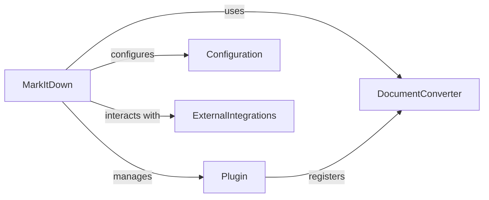

## Details

The MarkItDown system is centered around the MarkItDown class, which acts as the primary entry point for document conversion. It orchestrates the process by maintaining and prioritizing a collection of DocumentConverter instances. These converters, which can be either built-in or dynamically loaded via Plugin extensions, encapsulate the specific logic for transforming various input formats into Markdown. The MarkItDown class directly manages its operational parameters through a Configuration mechanism, accepting settings via initialization and environment variables. Furthermore, it handles ExternalIntegrations by directly utilizing libraries like requests for web content retrieval and magika for file type detection, and by enabling specialized converters to interact with external APIs. This design allows for a flexible and extensible conversion pipeline, where new document types and external services can be supported by adding or plugging in new DocumentConverter implementations.

### MarkItDown
This is the central orchestrator and high-level interface of the system. It acts as a facade, simplifying interactions for external clients by coordinating document conversion, managing plugins, and integrating with external services.

**Related Classes/Methods**:

- <a href="https://github.com/microsoft/markitdown/blob/main/packages/markitdown/src/markitdown/_markitdown.py#L93-L771" target="_blank" rel="noopener noreferrer">`packages.markitdown.src.markitdown._markitdown.markitdown`:93-771</a>

### DocumentConverter
This is an abstract base class or interface that defines the contract for all document conversion functionalities. Concrete implementations of this class handle the specific logic for transforming various document formats into Markdown. MarkItDown registers and utilizes instances of DocumentConverter to perform conversions.

**Related Classes/Methods**: _None_

### Plugin
This component represents the interface that external extensions must implement to integrate with the MarkItDown system. Plugins provide a register_converters method, allowing them to contribute custom DocumentConverter instances to the MarkItDown core.

**Related Classes/Methods**: _None_

### Configuration
This conceptual component represents the mechanism for managing application settings and operational parameters. While not a distinct class, MarkItDown directly handles configuration through constructor arguments and environment variables, influencing its behavior and external integrations.

**Related Classes/Methods**: _None_

### ExternalIntegrations
This conceptual component encompasses the direct interactions with external services. MarkItDown utilizes requests.Session for network requests and magika for file type identification. Specific converters, like DocumentIntelligenceConverter, also directly integrate with external APIs.

**Related Classes/Methods**: _None_

### [FAQ](https://github.com/CodeBoarding/GeneratedOnBoardings/tree/main?tab=readme-ov-file#faq)