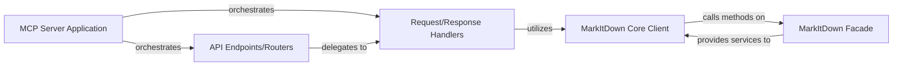

## Details

Updated analysis with specific source code references for 'API Endpoints/Routers', 'Request/Response Handlers', and 'MarkItDown Core Client' based on packages/markitdown-mcp/src/markitdown_mcp/__main__.py. No architectural changes were made.

### MCP Server Application
The foundational component responsible for initializing the web server, registering all defined API endpoints, and managing the overall lifecycle of the service. It acts as the central orchestrator for all incoming web requests.

**Related Classes/Methods**:

- <a href="https://github.com/microsoft/markitdown/blob/main/packages/markitdown-mcp/src/markitdown_mcp/__main__.py#L1-L1000" target="_blank" rel="noopener noreferrer">`markitdown_mcp.__main__` (1:1000)</a>

### API Endpoints/Routers
Defines the public interface of the MCP server. This component maps specific URL paths and HTTP methods (e.g., POST /convert) to the corresponding markitdown capabilities, receiving raw HTTP requests.

**Related Classes/Methods**:

- <a href="https://github.com/microsoft/markitdown/blob/main/packages/markitdown-mcp/src/markitdown_mcp/__main__.py#L72-L75" target="_blank" rel="noopener noreferrer">`markitdown_mcp.__main__.create_starlette_app` (72:75)</a>

### Request/Response Handlers
Processes the data contained within incoming HTTP requests (e.g., input documents, conversion parameters). This component validates inputs, prepares them for the core markitdown library, and after conversion, formats the results into suitable HTTP responses (e.g., JSON, converted document streams).

**Related Classes/Methods**:

- <a href="https://github.com/microsoft/markitdown/blob/main/packages/markitdown-mcp/src/markitdown_mcp/__main__.py#L43-L53" target="_blank" rel="noopener noreferrer">`markitdown_mcp.__main__.handle_sse` (43:53)</a>
- <a href="https://github.com/microsoft/markitdown/blob/main/packages/markitdown-mcp/src/markitdown_mcp/__main__.py#L55-L58" target="_blank" rel="noopener noreferrer">`markitdown_mcp.__main__.handle_streamable_http` (55:58)</a>

### MarkItDown Core Client
Acts as an adapter or wrapper for the core markitdown library. It translates the web service's input parameters into the arguments expected by the MarkItDown Facade methods and handles the results returned by the facade, preparing them for the Request/Response Handlers.

**Related Classes/Methods**:

- <a href="https://github.com/microsoft/markitdown/blob/main/packages/markitdown-mcp/src/markitdown_mcp/__main__.py#L20-L23" target="_blank" rel="noopener noreferrer">`markitdown_mcp.__main__.convert_to_markdown` (20:23)</a>

### MarkItDown Facade
This component belongs to the core markitdown library and serves as the primary, simplified interface that the MarkItDown Core Client interacts with. It provides a unified entry point to the complex underlying markitdown conversion capabilities.

**Related Classes/Methods**:

- `markitdown.facade.MarkItDownFacade` (1:1000)

### [FAQ](https://github.com/CodeBoarding/GeneratedOnBoardings/tree/main?tab=readme-ov-file#faq)