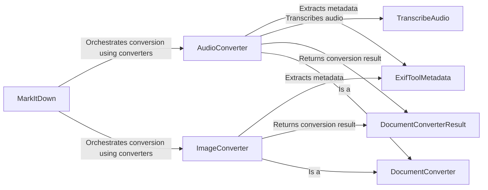

## Component Details

### MarkItDown
The central class responsible for orchestrating the conversion of various file types to markdown format. It determines the appropriate converter to use based on the input file type and manages the overall conversion process.
- **Related Classes/Methods**: `repos.markitdown.packages.markitdown.src.markitdown._markitdown.MarkItDown`

### AudioConverter
This component specializes in converting audio files to markdown. It extracts metadata from the audio file and transcribes the audio content into text, which is then formatted as markdown.
- **Related Classes/Methods**: `repos.markitdown.packages.markitdown.src.markitdown.converters._audio_converter.AudioConverter`

### ImageConverter
This component handles the conversion of image files to markdown. It extracts metadata from the image and can generate a description of the image, which is then formatted as markdown.
- **Related Classes/Methods**: `repos.markitdown.packages.markitdown.src.markitdown.converters._image_converter.ImageConverter`

### ExifToolMetadata
This component is responsible for extracting metadata from multimedia files using ExifTool. It provides a standardized way to access metadata information regardless of the file type.
- **Related Classes/Methods**: `repos.markitdown.packages.markitdown.src.markitdown.converters._exiftool.exiftool_metadata`

### TranscribeAudio
This component transcribes audio content into text. It uses an external transcription service to perform the transcription and handles any potential errors or missing dependencies.
- **Related Classes/Methods**: `repos.markitdown.packages.markitdown.src.markitdown.converters._transcribe_audio.transcribe_audio`

### DocumentConverterResult
This component represents the result of a document conversion. It encapsulates the generated markdown content and any extracted metadata, providing a structured way to access the conversion output.
- **Related Classes/Methods**: `repos.markitdown.packages.markitdown.src.markitdown._base_converter.DocumentConverterResult`

### DocumentConverter
This abstract class serves as the base for all converters. It defines the common interface and functionality that all converters must implement, ensuring consistency across different file types.
- **Related Classes/Methods**: `repos.markitdown.packages.markitdown.src.markitdown._base_converter.DocumentConverter`
