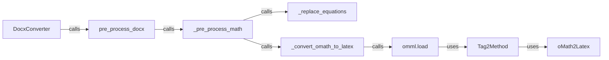

## Component Details

The DOCX to Markdown conversion process involves several key components working together to transform a .docx file into a markdown representation. The DocxConverter initiates the conversion, which includes pre-processing steps to handle complex elements like mathematical equations. The pre_process_docx function orchestrates these pre-processing steps, calling upon specialized functions to handle math equations. The _pre_process_math function identifies and prepares math equations for conversion, using _replace_equations to insert placeholders and _convert_omath_to_latex to convert OMML equations to LaTeX. The omml.load function parses the OMML structure, leveraging Tag2Method to process the tags and oMath2Latex to generate the final LaTeX code. This pipeline ensures that mathematical content is accurately converted and represented in the resulting markdown file.

### DocxConverter
The DocxConverter class is responsible for converting .docx files to markdown format. It initializes the converter and calls the pre-processing and conversion steps.
- **Related Classes/Methods**: `markitdown.packages.markitdown.src.markitdown.converters._docx_converter.DocxConverter.__init__` (33:35), `markitdown.packages.markitdown.src.markitdown.converters._docx_converter.DocxConverter.convert` (55:80)

### pre_process_docx
The pre_process_docx function performs pre-processing steps on the docx file before converting it to markdown. This includes handling math equations.
- **Related Classes/Methods**: `markitdown.packages.markitdown.src.markitdown.converter_utils.docx.pre_process.pre_process_docx` (118:156)

### _pre_process_math
The _pre_process_math function is responsible for pre-processing mathematical equations within the docx file. It identifies and replaces equations with a suitable format, likely LaTeX.
- **Related Classes/Methods**: `markitdown.packages.markitdown.src.markitdown.converter_utils.docx.pre_process._pre_process_math` (99:115)

### _replace_equations
The _replace_equations function replaces the identified equations within the docx content.
- **Related Classes/Methods**: `markitdown.packages.markitdown.src.markitdown.converter_utils.docx.pre_process._replace_equations` (74:96)

### _convert_omath_to_latex
The _convert_omath_to_latex function converts Office Math Markup Language (OMML) equations to LaTeX format.
- **Related Classes/Methods**: `markitdown.packages.markitdown.src.markitdown.converter_utils.docx.pre_process._convert_omath_to_latex` (33:49)

### omml.load
The `omml.load` function is responsible for loading and parsing the OMML from a string or file.
- **Related Classes/Methods**: `markitdown.packages.markitdown.src.markitdown.converter_utils.docx.math.omml.load` (43:46), `markitdown.packages.markitdown.src.markitdown.converter_utils.docx.math.omml.load_string` (49:52)

### Tag2Method
The Tag2Method class and its methods are responsible for processing the OMML tags and converting them to LaTeX. It uses different methods to process children based on whether they are in a list or a dictionary.
- **Related Classes/Methods**: `markitdown.packages.markitdown.src.markitdown.converter_utils.docx.math.omml.Tag2Method.process_children_list` (86:101), `markitdown.packages.markitdown.src.markitdown.converter_utils.docx.math.omml.Tag2Method.process_children_dict` (103:110), `markitdown.packages.markitdown.src.markitdown.converter_utils.docx.math.omml.Tag2Method.process_children` (112:121)

### oMath2Latex
The oMath2Latex class is responsible for converting the parsed OMML structure into LaTeX code. It contains methods for handling different OMML elements and constructs.
- **Related Classes/Methods**: `markitdown.packages.markitdown.src.markitdown.converter_utils.docx.math.omml.oMath2Latex.__init__` (179:180), `markitdown.packages.markitdown.src.markitdown.converter_utils.docx.math.omml.oMath2Latex.__unicode__` (185:186), `markitdown.packages.markitdown.src.markitdown.converter_utils.docx.math.omml.oMath2Latex.process_unknow` (188:194), `markitdown.packages.markitdown.src.markitdown.converter_utils.docx.math.omml.oMath2Latex.do_acc` (200:208)