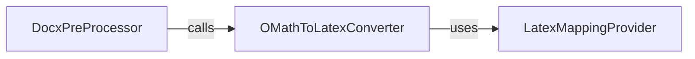

## Component Details

The chosen components are fundamental to the `OMath to LaTeX Converter` subsystem due to their distinct and critical roles in achieving the conversion goal: 1. `OMathToLatexConverter` (`markitdown.converter_utils.docx.math.omml.py`): This is the central and most crucial component. It encapsulates the entire logic for parsing OMML XML and generating LaTeX. The `oMath2Latex` class within this module is the primary orchestrator, with its `do_*` methods implementing the specific conversion rules for each OMML tag. The `Tag2Method` base class provides the extensible architecture for handling diverse OMML elements, while the `Pr` class efficiently manages common properties. The `load` and `load_string` functions serve as the entry points for initiating the conversion, making this module the operational heart of the subsystem. Without this component, the core functionality of converting OMML to LaTeX would not exist. 2. `LatexMappingProvider` (`markitdown.converter_utils.docx.math.latex_dict.py`): While not a class or function in itself, this module is indispensable. It acts as a configuration and data provider for the `OMathToLatexConverter`. It contains the dictionaries and constants (`CHARS`, `CHR`, `F`, `D`, etc.) that define the precise LaTeX syntax for various mathematical symbols, functions, and structures found in OMML. Separating these mappings into a dedicated module ensures maintainability, readability, and easy updates to the conversion rules. The `OMathToLatexConverter` directly depends on these mappings to produce correct LaTeX output. Without this component, the `OMathToLatexConverter` would lack the necessary knowledge to perform accurate translations. These two components, working in conjunction, form a complete and robust solution for the specialized task of OMML to LaTeX conversion within the `Docx Pre-processing Utilities`. The `OMathToLatexConverter` handles the "how-to" of conversion, while the `LatexMappingProvider` provides the "what-to" convert into.

### OMathToLatexConverter
This component is the core of the Office Math Markup Language (OMML) to LaTeX conversion process. It parses OMML XML structures, identifies mathematical elements, and translates them into their corresponding LaTeX representations. It leverages a dispatch mechanism to apply specific conversion rules based on OMML tags, ensuring accurate and robust transformation of complex equations.

**Related Classes/Methods**:

- <a href="https://github.com/microsoft/markitdown/blob/master/packages/markitdown/src/markitdown/converter_utils/docx/math/omml.py#L169-L399" target="_blank" rel="noopener noreferrer">`markitdown.converter_utils.docx.math.omml.oMath2Latex` (169:399)</a>
- <a href="https://github.com/microsoft/markitdown/blob/master/packages/markitdown/src/markitdown/converter_utils/docx/math/omml.py#L74-L123" target="_blank" rel="noopener noreferrer">`markitdown.converter_utils.docx.math.omml.Tag2Method` (74:123)</a>
- <a href="https://github.com/microsoft/markitdown/blob/master/packages/markitdown/src/markitdown/converter_utils/docx/math/omml.py#L126-L166" target="_blank" rel="noopener noreferrer">`markitdown.converter_utils.docx.math.omml.Pr` (126:166)</a>
- <a href="https://github.com/microsoft/markitdown/blob/master/packages/markitdown/src/markitdown/converter_utils/docx/math/omml.py#L42-L45" target="_blank" rel="noopener noreferrer">`markitdown.converter_utils.docx.math.omml.load` (42:45)</a>
- <a href="https://github.com/microsoft/markitdown/blob/master/packages/markitdown/src/markitdown/converter_utils/docx/math/omml.py#L48-L51" target="_blank" rel="noopener noreferrer">`markitdown.converter_utils.docx.math.omml.load_string` (48:51)</a>
- <a href="https://github.com/microsoft/markitdown/blob/master/packages/markitdown/src/markitdown/converter_utils/docx/math/omml.py#L54-L64" target="_blank" rel="noopener noreferrer">`markitdown.converter_utils.docx.math.omml.escape_latex` (54:64)</a>

### LatexMappingProvider
This component provides the essential mappings and constants required for converting OMML elements into their LaTeX equivalents. It acts as a data source for the `OMathToLatexConverter`, defining how various OMML characters, functions, and structures translate into LaTeX syntax.

**Related Classes/Methods**:

- <a href="https://github.com/microsoft/markitdown/blob/master/packages/markitdown/src/markitdown/converter_utils/docx/math/latex_dict.py#L1-L1" target="_blank" rel="noopener noreferrer">`markitdown.converter_utils.docx.math.latex_dict` (1:1)</a>

### [FAQ](https://github.com/CodeBoarding/GeneratedOnBoardings/tree/main?tab=readme-ov-file#faq)