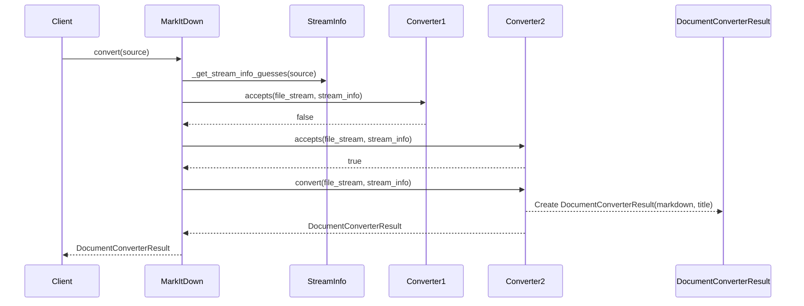
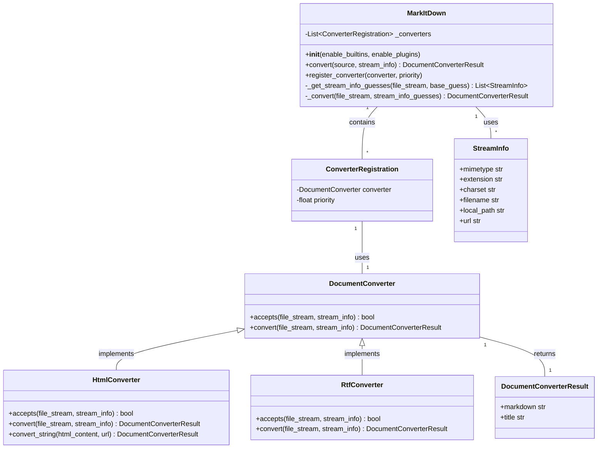

Okay, I have examined the source code for the core components: `MarkItDown`, `DocumentConverter`, `DocumentConverterResult`, `HtmlConverter`, and `RtfConverter`. Based on this, I can provide a more detailed overview of the `MarkItDown Orchestrator` component.

**Component Overview: MarkItDown Orchestrator**

The `MarkItDown Orchestrator` component is responsible for managing the conversion of various document types into Markdown format. It provides a central point for registering and utilizing different document converters.

**Main Classes and Their Purposes:**

*   **`MarkItDown`**: This is the central class that orchestrates the entire conversion process.
    *   It maintains a list of registered `DocumentConverter` instances.
    *   It uses `StreamInfo` to determine the file type and encoding.
    *   The `convert()` method accepts a source (path, URL, stream) and dispatches the conversion to the appropriate converter.
    *   It handles the registration of both built-in and plugin-based converters.
    *   It uses `magika` to identify the stream content.
*   **`DocumentConverter`**: This is an abstract base class that defines the interface for all document converters.
    *   The `accepts()` method determines whether a converter can handle a given file based on its `StreamInfo` (mimetype, extension, etc.).
    *   The `convert()` method performs the actual conversion from the document to Markdown.
*   **`DocumentConverterResult`**: A simple data class that encapsulates the result of a conversion, containing the Markdown content and an optional title.
*   **`HtmlConverter`**: A concrete `DocumentConverter` that converts HTML files to Markdown using `BeautifulSoup` for parsing and `_CustomMarkdownify` (not examined) for the actual conversion.
*   **`RtfConverter`**: A concrete `DocumentConverter` (plugin example) that converts RTF files to Markdown using `striprtf` library.

**Main Flow (Sequence Diagram):**

**Component Structure (Class Diagram):**

**Brief Description:**

The `MarkItDown Orchestrator` component provides a flexible and extensible way to convert documents of various formats into Markdown. The central class, `MarkItDown`, manages the registration and execution of `DocumentConverter` instances. Converters are selected based on the `accepts()` method, which uses `StreamInfo` to determine the file type. The `convert()` method then performs the actual conversion, returning a `DocumentConverterResult` containing the Markdown content. Concrete converter implementations, such as `HtmlConverter` and `RtfConverter`, handle specific file formats.