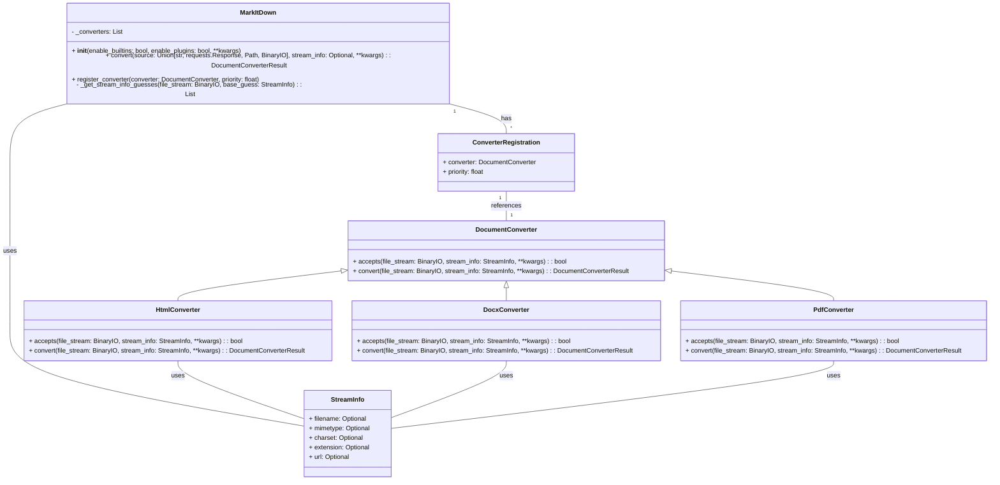

Based on the code analysis, here's a refined overview of the `markitdown` component:

**Description:**

The `markitdown` component is a versatile tool designed to convert various document formats and web resources into Markdown. It orchestrates the conversion process, leveraging a modular architecture that supports built-in converters and external plugins. The core functionality revolves around identifying the input type, selecting an appropriate converter, and generating Markdown output.

**Main Classes and Their Purposes:**

1.  **`MarkItDown`**: This is the central class responsible for managing the conversion process. It handles converter registration, input stream analysis, and delegation to the appropriate converter. It also manages the configuration of built-in converters and plugins.
2.  **`DocumentConverter`**: An abstract base class that defines the interface for all document converters. Subclasses implement the `accepts` method to determine if they can handle a given input and the `convert` method to perform the actual conversion.
3.  **`HtmlConverter`**: A concrete `DocumentConverter` that handles HTML files. It uses `BeautifulSoup` to parse the HTML and extracts the main content, converting it to Markdown using a custom Markdownify implementation.
4.  **`DocxConverter`**: A concrete `DocumentConverter` that handles DOCX files. It leverages the `mammoth` library to convert DOCX to HTML and then uses the `HtmlConverter` to convert the HTML to Markdown.
5.  **`PdfConverter`**: A concrete `DocumentConverter` that handles PDF files. It uses `pdfminer.six` to extract text from the PDF and returns the text as Markdown.
6.  **`StreamInfo`**: A data class that encapsulates information about the input stream, such as the filename, MIME type, and charset. This information is used to determine the appropriate converter to use.
7.  **`ConverterRegistration`**: A data class that associates a `DocumentConverter` with a priority. This allows for fine-grained control over the order in which converters are tried.
8.  **`main` (in `markitdown.__main__`)**: The entry point for the command-line interface. It parses command-line arguments, initializes the `MarkItDown` class, and performs the conversion.
9.  **`CLI` (in `markitdown.cli`)**: Contains tests for the command-line interface.

**Visualization:**

A class diagram effectively represents the structure of the `markitdown` component, highlighting the relationships between the main classes.

