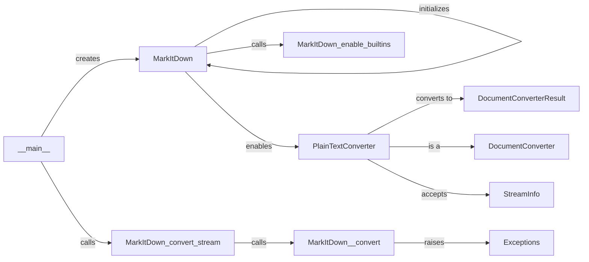

## Component Details

### MarkItDown
The central class responsible for orchestrating the document conversion process. It manages the registration and enabling of different converters, and it provides the main entry point for converting documents from various formats to Markdown. It initializes the available converters and calls the appropriate converter based on the input document's format.
- **Related Classes/Methods**: `repos.markitdown.packages.markitdown.src.markitdown._markitdown.MarkItDown`, `repos.markitdown.packages.markitdown.src.markitdown._markitdown.MarkItDown.enable_builtins`, `repos.markitdown.packages.markitdown.src.markitdown._markitdown.MarkItDown.__init__`, `repos.markitdown.packages.markitdown.src.markitdown._markitdown.MarkItDown.convert_stream`, `repos.markitdown.packages.markitdown.src.markitdown._markitdown.MarkItDown._convert`

### PlainTextConverter
A specialized converter designed to handle plain text files. It determines if the input is plain text based on its mimetype, extension, or charset. If the input is plain text, it reads the content and returns it as Markdown. It interacts with the MarkItDown class by registering itself as a supported converter.
- **Related Classes/Methods**: `repos.markitdown.packages.markitdown.src.markitdown.converters._plain_text_converter.PlainTextConverter`, `repos.markitdown.packages.markitdown.src.markitdown.converters._plain_text_converter.PlainTextConverter:convert`, `repos.markitdown.packages.markitdown.src.markitdown.converters._plain_text_converter.PlainTextConverter.accepts`

### DocumentConverterResult
A data class that encapsulates the result of a document conversion. It contains the converted text (in Markdown format) and any relevant metadata about the conversion process. It is the standard output format for all converters, including the PlainTextConverter.
- **Related Classes/Methods**: `repos.markitdown.packages.markitdown.src.markitdown._base_converter.DocumentConverterResult`

### DocumentConverter
An abstract base class for all document converters. It defines the interface that all converters must implement, ensuring a consistent way to handle different document formats. PlainTextConverter inherits from this class.
- **Related Classes/Methods**: `repos.markitdown.packages.markitdown.src.markitdown._base_converter.DocumentConverter`

### StreamInfo
A data class that encapsulates information about the input stream, such as its mimetype, extension, and charset. This information is used by the converters to determine if they can handle the input stream. The PlainTextConverter uses StreamInfo to check if the input is plain text.
- **Related Classes/Methods**: `repos.markitdown.packages.markitdown.src.markitdown._stream_info.StreamInfo`

### __main__
The entry point of the markitdown application. It initializes the MarkItDown converter and triggers the conversion process by calling the convert_stream method.
- **Related Classes/Methods**: `repos.markitdown.packages.markitdown.src.markitdown.__main__:main`

### Exceptions
A collection of custom exception classes used for error handling during the conversion process. These exceptions provide specific information about the type of error that occurred, such as a failed conversion attempt or an unsupported format.
- **Related Classes/Methods**: `repos.markitdown.packages.markitdown.src.markitdown._exceptions.FailedConversionAttempt`, `repos.markitdown.packages.markitdown.src.markitdown._exceptions.UnsupportedFormatException`, `repos.markitdown.packages.markitdown.src.markitdown._exceptions.FileConversionException`
