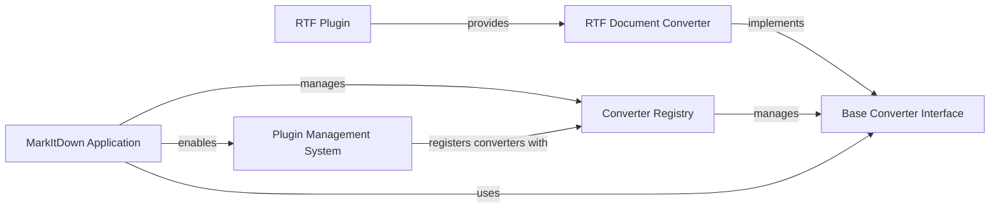

## Component Details

The MarkItDown system provides a flexible framework for converting various document types into Markdown. Its core functionality revolves around a pluggable architecture, allowing for easy extension through custom converters. The system orchestrates the discovery, loading, and registration of these converters, ensuring that the appropriate conversion logic is applied based on the input document's type.

### MarkItDown Application
The primary entry point and orchestrator of the MarkItDown system. It initializes the conversion environment, manages the registration of various document converters (both built-in and plugin-provided), and provides methods for converting different types of input sources into Markdown.

**Related Classes/Methods**:

- <a href="https://github.com/microsoft/markitdown/blob/master/packages/markitdown/src/markitdown/_markitdown.py#L93-L771" target="_blank" rel="noopener noreferrer">`markitdown._markitdown.MarkItDown` (93:771)</a>
- <a href="https://github.com/microsoft/markitdown/blob/master/packages/markitdown/src/markitdown/_markitdown.py#L97-L130" target="_blank" rel="noopener noreferrer">`markitdown._markitdown.MarkItDown.__init__` (97:130)</a>
- <a href="https://github.com/microsoft/markitdown/blob/master/packages/markitdown/src/markitdown/_markitdown.py#L223-L241" target="_blank" rel="noopener noreferrer">`markitdown._markitdown.MarkItDown.enable_plugins` (223:241)</a>
- <a href="https://github.com/microsoft/markitdown/blob/master/packages/markitdown/src/markitdown/_markitdown.py#L243-L291" target="_blank" rel="noopener noreferrer">`markitdown._markitdown.MarkItDown.convert` (243:291)</a>

### Plugin Management System
Provides the framework for extending `markitdown`'s capabilities through external plugins. It handles the discovery, loading, and registration of custom `DocumentConverter` implementations with the `Core Conversion Engine`. This component includes the logic for finding and loading plugin entry points.

**Related Classes/Methods**:

- <a href="https://github.com/microsoft/markitdown/blob/master/packages/markitdown/src/markitdown/_markitdown.py#L223-L241" target="_blank" rel="noopener noreferrer">`markitdown._markitdown.MarkItDown.enable_plugins` (223:241)</a>
- <a href="https://github.com/microsoft/markitdown/blob/master/packages/markitdown/src/markitdown/_markitdown.py#L65-L82" target="_blank" rel="noopener noreferrer">`markitdown._markitdown._load_plugins` (65:82)</a>
- <a href="https://github.com/microsoft/markitdown/blob/master/packages/markitdown-sample-plugin/src/markitdown_sample_plugin/_plugin.py#L25-L31" target="_blank" rel="noopener noreferrer">`markitdown_sample_plugin._plugin.register_converters` (25:31)</a>

### Converter Registry
Manages the collection of all available document converters within the MarkItDown system. It stores converters along with their priorities, ensuring that the most appropriate converter is selected for a given document type during the conversion process.

**Related Classes/Methods**:

- <a href="https://github.com/microsoft/markitdown/blob/master/packages/markitdown/src/markitdown/_markitdown.py#L629-L659" target="_blank" rel="noopener noreferrer">`markitdown._markitdown.MarkItDown.register_converter` (629:659)</a>
- <a href="https://github.com/microsoft/markitdown/blob/master/packages/markitdown/src/markitdown/_markitdown.py#L86-L90" target="_blank" rel="noopener noreferrer">`markitdown._markitdown.ConverterRegistration` (86:90)</a>

### Base Converter Interface
Defines the fundamental contract for all document converters. It specifies the 'accepts' method for determining converter applicability and the 'convert' method for performing the actual document transformation into Markdown. It also includes the 'DocumentConverterResult' class for standardizing conversion output.

**Related Classes/Methods**:

- <a href="https://github.com/microsoft/markitdown/blob/master/packages/markitdown/src/markitdown/_base_converter.py#L42-L105" target="_blank" rel="noopener noreferrer">`markitdown._base_converter.DocumentConverter` (42:105)</a>
- <a href="https://github.com/microsoft/markitdown/blob/master/packages/markitdown/src/markitdown/_base_converter.py#L5-L39" target="_blank" rel="noopener noreferrer">`markitdown._base_converter.DocumentConverterResult` (5:39)</a>

### RTF Plugin
An extension module that provides specific functionality for converting Rich Text Format (RTF) documents. It implements the 'register_converters' function to integrate its 'RtfConverter' into the MarkItDown system.

**Related Classes/Methods**:

- <a href="https://github.com/microsoft/markitdown/blob/master/packages/markitdown-sample-plugin/src/markitdown_sample_plugin/_plugin.py#L25-L31" target="_blank" rel="noopener noreferrer">`markitdown_sample_plugin._plugin.register_converters` (25:31)</a>
- <a href="https://github.com/microsoft/markitdown/blob/master/packages/markitdown-sample-plugin/src/markitdown_sample_plugin/_plugin.py#L34-L71" target="_blank" rel="noopener noreferrer">`markitdown_sample_plugin._plugin.RtfConverter` (34:71)</a>

### RTF Document Converter
A specialized converter that inherits from the 'Base Converter Interface' and is capable of transforming RTF content into Markdown. It uses an external library ('striprtf') to handle the RTF parsing.

**Related Classes/Methods**:

- <a href="https://github.com/microsoft/markitdown/blob/master/packages/markitdown-sample-plugin/src/markitdown_sample_plugin/_plugin.py#L34-L71" target="_blank" rel="noopener noreferrer">`markitdown_sample_plugin._plugin.RtfConverter` (34:71)</a>
- <a href="https://github.com/microsoft/markitdown/blob/master/packages/markitdown-sample-plugin/src/markitdown_sample_plugin/_plugin.py#L57-L71" target="_blank" rel="noopener noreferrer">`markitdown_sample_plugin._plugin.RtfConverter:convert` (57:71)</a>

### [FAQ](https://github.com/CodeBoarding/GeneratedOnBoardings/tree/main?tab=readme-ov-file#faq)