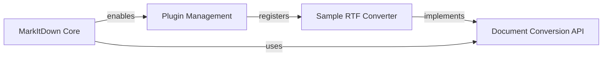

## Component Details

This graph illustrates the core components and their interactions within the MarkItDown system, focusing on its extensibility through a plugin architecture. The MarkItDown Core orchestrates the document conversion process and enables external plugins. The Plugin Management component handles the discovery, loading, and registration of these plugins. The Document Conversion API defines the standard interfaces for all converters, ensuring interoperability. Finally, the Sample RTF Converter demonstrates a concrete implementation of a plugin, converting RTF documents to Markdown, and registers itself with the Plugin Management system.

### MarkItDown Core
The central component of the MarkItDown library, responsible for managing the overall document conversion process, including enabling plugins and dispatching conversion tasks to registered converters.

**Related Classes/Methods**:

- <a href="https://github.com/microsoft/markitdown/blob/master/packages/markitdown/src/markitdown/_markitdown.py#L93-L771" target="_blank" rel="noopener noreferrer">`markitdown.packages.markitdown.src.markitdown._markitdown.MarkItDown` (93:771)</a>
- <a href="https://github.com/microsoft/markitdown/blob/master/packages/markitdown/src/markitdown/_markitdown.py#L65-L82" target="_blank" rel="noopener noreferrer">`markitdown.packages.markitdown.src.markitdown._markitdown._load_plugins` (65:82)</a>
- <a href="https://github.com/microsoft/markitdown/blob/master/packages/markitdown/src/markitdown/_markitdown.py#L223-L241" target="_blank" rel="noopener noreferrer">`markitdown.packages.markitdown.src.markitdown._markitdown.MarkItDown:enable_plugins` (223:241)</a>

### Plugin Management
Manages the discovery, loading, and registration of external plugins, allowing the MarkItDown system to be extended with custom document converters and functionalities beyond its built-in capabilities.

**Related Classes/Methods**:

- <a href="https://github.com/microsoft/markitdown/blob/master/packages/markitdown/src/markitdown/_markitdown.py#L65-L82" target="_blank" rel="noopener noreferrer">`markitdown.packages.markitdown.src.markitdown._markitdown._load_plugins` (65:82)</a>
- <a href="https://github.com/microsoft/markitdown/blob/master/packages/markitdown/src/markitdown/_markitdown.py#L223-L241" target="_blank" rel="noopener noreferrer">`markitdown.packages.markitdown.src.markitdown._markitdown.MarkItDown:enable_plugins` (223:241)</a>
- <a href="https://github.com/microsoft/markitdown/blob/master/packages/markitdown-sample-plugin/src/markitdown_sample_plugin/_plugin.py#L25-L31" target="_blank" rel="noopener noreferrer">`markitdown.packages.markitdown-sample-plugin.src.markitdown_sample_plugin._plugin.register_converters` (25:31)</a>

### Document Conversion API
Defines the fundamental interfaces and data structures for document conversion within the MarkItDown system, including the DocumentConverter abstract class and the DocumentConverterResult for standardized output.

**Related Classes/Methods**:

- <a href="https://github.com/microsoft/markitdown/blob/master/packages/markitdown/src/markitdown/_base_converter.py#L42-L105" target="_blank" rel="noopener noreferrer">`markitdown._base_converter.DocumentConverter` (42:105)</a>
- <a href="https://github.com/microsoft/markitdown/blob/master/packages/markitdown/src/markitdown/_base_converter.py#L5-L39" target="_blank" rel="noopener noreferrer">`markitdown._base_converter.DocumentConverterResult` (5:39)</a>

### Sample RTF Converter
A specific implementation of a document converter that specializes in transforming Rich Text Format (RTF) content into Markdown. It is provided as a sample plugin to demonstrate the plugin extensibility.

**Related Classes/Methods**:

- <a href="https://github.com/microsoft/markitdown/blob/master/packages/markitdown-sample-plugin/src/markitdown_sample_plugin/_plugin.py#L34-L71" target="_blank" rel="noopener noreferrer">`markitdown.packages.markitdown-sample-plugin.src.markitdown_sample_plugin._plugin.RtfConverter` (34:71)</a>
- <a href="https://github.com/microsoft/markitdown/blob/master/packages/markitdown-sample-plugin/src/markitdown_sample_plugin/_plugin.py#L57-L71" target="_blank" rel="noopener noreferrer">`markitdown.packages.markitdown-sample-plugin.src.markitdown_sample_plugin._plugin.RtfConverter:convert` (57:71)</a>
- <a href="https://github.com/microsoft/markitdown/blob/master/packages/markitdown-sample-plugin/src/markitdown_sample_plugin/_plugin.py#L25-L31" target="_blank" rel="noopener noreferrer">`markitdown.packages.markitdown-sample-plugin.src.markitdown_sample_plugin._plugin.register_converters` (25:31)</a>

### [FAQ](https://github.com/CodeBoarding/GeneratedOnBoardings/tree/main?tab=readme-ov-file#faq)