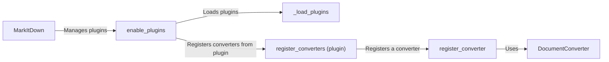

## Component Details

The Plugin Manager component in MarkItDown enables the dynamic extension of the application's functionality by allowing developers to create and register custom converters for different file formats or data sources. This system revolves around loading plugins, registering their converters with the main MarkItDown class, and then utilizing these converters during the document conversion process. The core components involved are the MarkItDown class, which manages the converters; the plugin loading mechanism, which discovers and loads plugins; the converter registration process, which adds converters to the MarkItDown instance; and the converter interface, which defines the contract for all converters.

### MarkItDown
The central class responsible for managing and applying document converters. It maintains a list of registered converters, sorts them by priority, and applies them sequentially until a suitable converter is found for a given document type.
- **Related Classes/Methods**: `markitdown.packages.markitdown.src.markitdown._markitdown.MarkItDown` (93:771)

### enable_plugins
This component is responsible for enabling and registering the converters provided by external plugins. It iterates through the available plugins, loads them, and registers their converters with the MarkItDown instance, making them available for document conversion.
- **Related Classes/Methods**: `markitdown.packages.markitdown.src.markitdown._markitdown.MarkItDown:enable_plugins` (223:241)

### _load_plugins
This function discovers and loads plugins using entry points. It expects each plugin to have a `register_converters` function, which is then called to register the plugin's converters.
- **Related Classes/Methods**: `markitdown.packages.markitdown.src.markitdown._markitdown._load_plugins` (65:82)

### register_converters (plugin)
This function is the entry point for a plugin to register its converters with the MarkItDown instance. It receives the MarkItDown instance as an argument and calls the `register_converter` method to register each converter provided by the plugin.
- **Related Classes/Methods**: `markitdown.packages.markitdown-sample-plugin.src.markitdown_sample_plugin._plugin:register_converters` (25:31)

### register_converter
This method registers a single document converter with the MarkItDown instance. It takes a converter instance and a priority value as arguments and adds the converter to the list of registered converters, sorted by priority.
- **Related Classes/Methods**: `markitdown.packages.markitdown.src.markitdown._markitdown.MarkItDown:register_converter` (629:659)

### DocumentConverter
This abstract class defines the interface that all document converters must implement. It provides a common base class for all converters, ensuring that they all have a consistent interface for converting documents.
- **Related Classes/Methods**: `markitdown.packages.markitdown.src.markitdown._base_converter.DocumentConverter` (42:105)