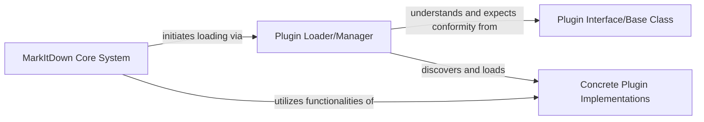

## Details

The `markitdown` project provides a flexible document processing system capable of converting various file types and web content into Markdown. Its core functionality is extended through a robust plugin architecture, allowing for dynamic discovery and integration of custom converters. The system prioritizes specific file formats before resorting to more generic converters, ensuring efficient and accurate document transformation.

### Plugin Loader/Manager
This component is responsible for orchestrating the discovery and dynamic loading of plugins. It leverages Python's entry point mechanism to find and load registered plugins, making them available to the core system.

**Related Classes/Methods**:

- <a href="https://github.com/microsoft/markitdown/blob/main/packages/markitdown/src/markitdown/_markitdown.py#L65-L82" target="_blank" rel="noopener noreferrer">`markitdown._markitdown._load_plugins`:65-82</a>

### Plugin Interface/Base Class
This component defines the standardized contract (interface or base class) that all external or custom plugins must implement to integrate with the `markitdown` system. It ensures extensibility and provides a consistent way for the core system to interact with diverse plugin functionalities.

**Related Classes/Methods**:

- <a href="https://github.com/microsoft/markitdown/blob/main/packages/markitdown/src/markitdown/_base_converter.py#L42-L105" target="_blank" rel="noopener noreferrer">`markitdown._base_converter.DocumentConverter`:42-105</a>

### Concrete Plugin Implementations
These are actual, specific implementations of plugins that adhere to the `Plugin Interface/Base Class`. They provide the extended functionality (e.g., new converters, custom processing logic) that the `markitdown` system can dynamically load and utilize.

**Related Classes/Methods**:

- <a href="https://github.com/microsoft/markitdown/blob/main/packages/markitdown/src/markitdown/converters/_plain_text_converter.py" target="_blank" rel="noopener noreferrer">`markitdown.converters.PlainTextConverter`</a>

### MarkItDown Core System
This is the main system responsible for document processing. Within the context of the Plugin Management System, it acts as the consumer of the loaded plugins, utilizing their extended functionalities to enhance its core operations.

**Related Classes/Methods**:

- <a href="https://github.com/microsoft/markitdown/blob/main/packages/markitdown/src/markitdown/_markitdown.py#L93-L771" target="_blank" rel="noopener noreferrer">`markitdown._markitdown.MarkItDown`:93-771</a>

### [FAQ](https://github.com/CodeBoarding/GeneratedOnBoardings/tree/main?tab=readme-ov-file#faq)