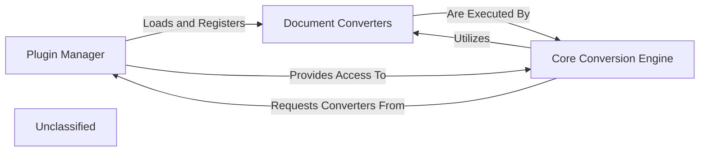

## Details

The `markitdown` library's conversion subsystem is built around a pluggable architecture. The `Plugin Manager` is responsible for discovering and registering various `Document Converters`, which are specialized components designed to transform specific document formats into Markdown. These converters adhere to a common interface defined by `BaseConverter`. The `Core Conversion Engine` acts as the central orchestrator, leveraging the `Plugin Manager` to access and utilize the appropriate `Document Converters` to perform the actual conversion process. This design allows for easy extension and integration of new document formats without modifying the core conversion logic.

### Plugin Manager [[Expand]](./Plugin_Manager.md)
Responsible for identifying, loading, and registering external document converters and processing plugins. It acts as the gateway for extending the library's capabilities without altering the core codebase.

**Related Classes/Methods**:

- <a href="https://github.com/microsoft/markitdown/blob/main/packages/markitdown/src/markitdown/_markitdown.py" target="_blank" rel="noopener noreferrer">`markitdown._markitdown.MarkItDown:enable_plugins`</a>

### Core Conversion Engine
The central orchestrator of the document conversion process. It utilizes the plugins and converters made available by the `Plugin Manager` to transform various input documents into Markdown format. The `MarkItDown` class embodies this engine.

**Related Classes/Methods**:

- <a href="https://github.com/microsoft/markitdown/blob/main/packages/markitdown/src/markitdown/_markitdown.py#L93-L776" target="_blank" rel="noopener noreferrer">`markitdown._markitdown.MarkItDown`:93-776</a>

### Document Converters
These are the individual, pluggable components (both built-in and external) that perform the actual format-specific conversion tasks (e.g., PDF to Markdown, DOCX to Markdown). They adhere to a defined interface, allowing them to be discovered and utilized by the `Plugin Manager` and `Core Conversion Engine`.

**Related Classes/Methods**:

- <a href="https://github.com/microsoft/markitdown/blob/main/packages/markitdown/src/markitdown/_base_converter.py" target="_blank" rel="noopener noreferrer">`markitdown._base_converter.BaseConverter`</a>
- <a href="https://github.com/microsoft/markitdown/blob/main/packages/markitdown/src/markitdown/converters/_pdf_converter.py" target="_blank" rel="noopener noreferrer">`markitdown.converters._pdf_converter.PdfConverter`</a>
- <a href="https://github.com/microsoft/markitdown/blob/main/packages/markitdown/src/markitdown/converters/_docx_converter.py" target="_blank" rel="noopener noreferrer">`markitdown.converters._docx_converter.DocxConverter`</a>

### Unclassified
Component for all unclassified files and utility functions (Utility functions/External Libraries/Dependencies)

**Related Classes/Methods**: _None_

### [FAQ](https://github.com/CodeBoarding/GeneratedOnBoardings/tree/main?tab=readme-ov-file#faq)