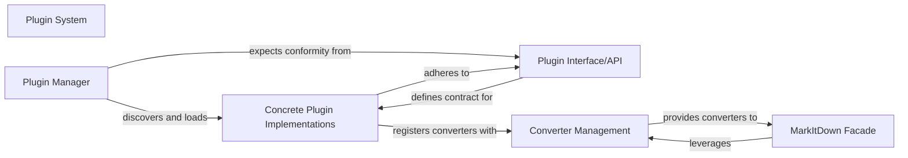

## Details

Updated architectural analysis with specific source code references.

### Plugin System [[Expand]](./Plugin_System.md)
The primary architectural component responsible for enabling the extensibility of the framework. It provides the infrastructure for external modules to register new converters and other functionalities, adhering to the "Extensible Framework (Plugin-based)" pattern.

**Related Classes/Methods**:

- `markitdown._markitdown.MarkItDown` (1:100)

### Plugin Manager
A core part of the `Plugin System` responsible for the discovery, loading, and lifecycle management of external plugins. It ensures that loaded plugins conform to the expected interface.

**Related Classes/Methods**:

- `markitdown._markitdown.MarkItDown` (1:100)

### Plugin Interface/API
Defines the contract (methods, properties) that all external plugins must implement to be compatible with and integrated into the MarkItDown framework. It acts as the blueprint for plugin development.

**Related Classes/Methods**:

- `markitdown._base_converter.BaseConverter` (1:100)

### Concrete Plugin Implementations
Actual external modules developed by third parties or as part of the project (e.g., `markitdown-sample-plugin`) that adhere to the `Plugin Interface/API` to provide specific functionalities, such as new document converters.

**Related Classes/Methods**:

- `markitdown.converters._docx_converter.DocxConverter` (1:100)
- `markitdown.converters._html_converter.HtmlConverter` (1:100)

### Converter Management
A component within the `Core Conversion Engine` responsible for registering, storing, and providing access to all available document converters, including those contributed by plugins.

**Related Classes/Methods**:

- `markitdown._markitdown.MarkItDown` (1:100)

### MarkItDown Facade
The primary entry point and simplified interface to the MarkItDown core library, orchestrating complex operations and leveraging the `Converter Management` to access available converters.

**Related Classes/Methods**:

- `markitdown._markitdown.MarkItDown` (1:100)

### [FAQ](https://github.com/CodeBoarding/GeneratedOnBoardings/tree/main?tab=readme-ov-file#faq)