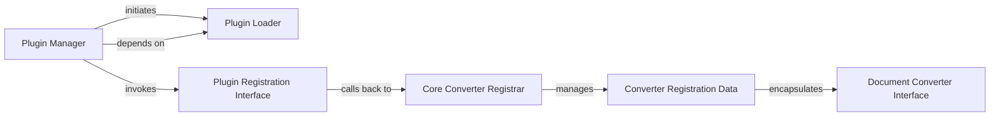

## Details

The `markitdown` project's plugin subsystem facilitates the dynamic integration of document conversion capabilities. The core `MarkItDown` class acts as the `Plugin Manager`, orchestrating the loading of external plugins and registering their custom `DocumentConverter` implementations. The `Plugin Loader` component is responsible for discovering and importing these plugin modules. Once loaded, each plugin interacts with the `Core Converter Registrar` through a `Plugin Registration Interface` to provide its `Document Converter Interface` implementations. These converters, along with their metadata, are encapsulated within `Converter Registration Data` objects, allowing the system to manage and prioritize them for document conversion tasks.

### Plugin Manager
This component orchestrates the entire plugin integration process. It initiates the discovery and loading of external plugin modules and then triggers their registration routines, ensuring that custom converters are made available to the core system.

**Related Classes/Methods**:

- <a href="https://github.com/microsoft/markitdown/blob/main/packages/markitdown/src/markitdown/_markitdown.py#L140-L157" target="_blank" rel="noopener noreferrer">`markitdown._markitdown.MarkItDown.enable_plugins`:140-157)</a>

### Plugin Loader
Handles the dynamic discovery and loading of plugin modules from the environment. It's an internal utility that the Plugin Manager relies upon to bring plugin code into the application's runtime.

**Related Classes/Methods**:

- <a href="https://github.com/microsoft/markitdown/blob/main/packages/markitdown/src/markitdown/_markitdown.py#L64-L81" target="_blank" rel="noopener noreferrer">`markitdown._markitdown._load_plugins`:64-81)</a>

### Plugin Registration Interface
This component represents the specific method or function within an external plugin that is invoked by the core system to register the plugin's custom DocumentConverter implementations. It defines the contract for how plugins expose their capabilities.

**Related Classes/Methods**:

- <a href="https://github.com/microsoft/markitdown/blob/main/packages/markitdown-sample-plugin/src/markitdown_sample_plugin/_plugin.py#L24-L30" target="_blank" rel="noopener noreferrer">`markitdown_sample_plugin._plugin.register_converters`:24-30)</a>

### Core Converter Registrar
This component is the core system's mechanism for accepting and managing DocumentConverter instances provided by plugins. It receives the converters from the Plugin Registration Interface and integrates them into the system's internal converter registry.

**Related Classes/Methods**:

- <a href="https://github.com/microsoft/markitdown/blob/main/packages/markitdown/src/markitdown/_markitdown.py#L360-L385" target="_blank" rel="noopener noreferrer">`markitdown._markitdown.MarkItDown.register_converter`:360-385)</a>

### Document Converter Interface
An abstract interface that all document converters, whether built-in or provided by plugins, must implement. It defines the common contract for how documents are converted, ensuring interoperability within the conversion pipeline.

**Related Classes/Methods**:

- <a href="https://github.com/microsoft/markitdown/blob/main/packages/markitdown/src/markitdown/_markitdown.py#L92-L100" target="_blank" rel="noopener noreferrer">`markitdown._markitdown.DocumentConverter`:92-100)</a>

### Converter Registration Data
This internal data structure encapsulates a DocumentConverter instance along with metadata like its priority. It is used by the Core Converter Registrar to manage and organize the collection of available converters.

**Related Classes/Methods**:

- <a href="https://github.com/microsoft/markitdown/blob/main/packages/markitdown/src/markitdown/_markitdown.py#L84-L89" target="_blank" rel="noopener noreferrer">`markitdown._markitdown.ConverterRegistration`:84-89)</a>

### [FAQ](https://github.com/CodeBoarding/GeneratedOnBoardings/tree/main?tab=readme-ov-file#faq)