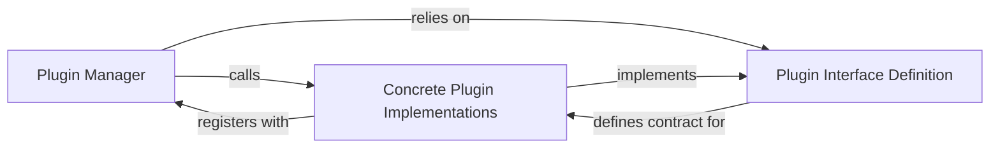

## Details

The Plugin System subsystem is a cornerstone of markitdown's extensibility, enabling the dynamic integration of custom conversion logic. It adheres to a Microkernel/Plugin Architecture pattern, allowing third-party developers to extend the system's capabilities without modifying the core.

### Plugin Manager
The core orchestrator for managing the lifecycle of plugins. It is responsible for identifying, loading, and integrating external converter modules into the markitdown system. It acts as the central registry for all available converters.

**Related Classes/Methods**:

- `markitdown._markitdown` (1:1)
- `markitdown.plugins.interface:register_converters` (1:1)
- `markitdown.plugins.interface:accepts` (1:1)
- `markitdown.plugins.interface:convert` (1:1)

### Plugin Interface Definition
A set of abstract methods and conventions that all external plugins must adhere to. This interface ensures compatibility and provides a standardized way for plugins to expose their conversion capabilities to the Plugin Manager. It defines the contract for how plugins interact with the core system.

**Related Classes/Methods**:

- `markitdown.plugins.interface:register_converters` (1:1)
- `markitdown.plugins.interface:accepts` (1:1)
- `markitdown.plugins.interface:convert` (1:1)

### Concrete Plugin Implementations
Actual modules or packages developed by third parties (or as examples) that implement the Plugin Interface Definition. These modules contain the specific logic for converting various document types and register themselves with the Plugin Manager upon loading. The markitdown-sample-plugin serves as a prime example.

**Related Classes/Methods**:

- `markitdown_sample_plugin._plugin` (1:1)
- `markitdown_sample_plugin._plugin:register_converters` (1:1)
- `markitdown_sample_plugin._plugin:accepts` (1:1)
- `markitdown_sample_plugin._plugin:convert` (1:1)

### [FAQ](https://github.com/CodeBoarding/GeneratedOnBoardings/tree/main?tab=readme-ov-file#faq)