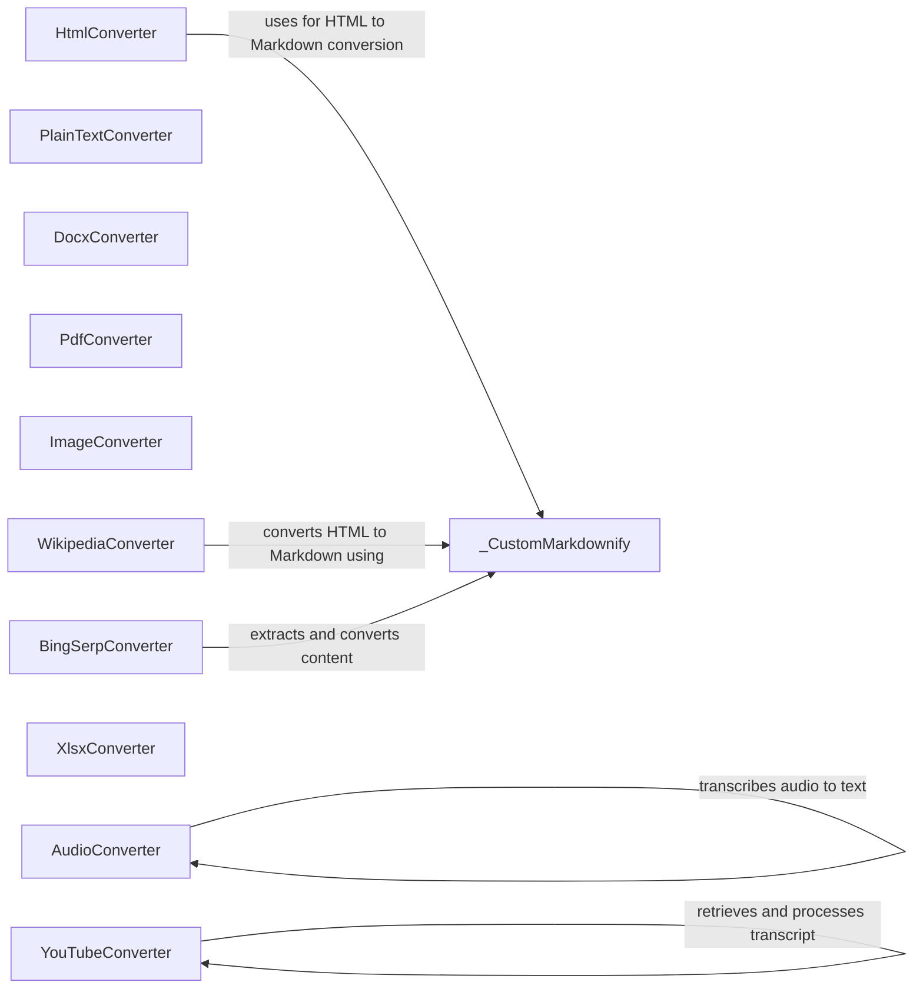

## Component Details

### HtmlConverter
Converter for HTML files. It uses BeautifulSoup to parse HTML, removes script and style blocks, and then uses _CustomMarkdownify to convert the HTML body to Markdown. It interacts with _CustomMarkdownify to perform the conversion to Markdown.
- **Related Classes/Methods**: `markitdown.converters._html_converter.HtmlConverter`

### _CustomMarkdownify
Custom Markdownify class for converting HTML to Markdown. It's used by the HtmlConverter and other converters that produce HTML as intermediate output. It provides the core logic for converting HTML elements to Markdown.
- **Related Classes/Methods**: `markitdown.converters._markdownify._CustomMarkdownify`

### PlainTextConverter
Converter for plain text files. It simply reads the text and returns it as Markdown. It's a straightforward converter that directly processes plain text input.
- **Related Classes/Methods**: `markitdown.converters._plain_text_converter.PlainTextConverter`

### DocxConverter
Converter for DOCX files. It extracts text and formatting from DOCX files and converts it to Markdown. It handles the complexities of the DOCX format to extract meaningful content.
- **Related Classes/Methods**: `markitdown.converters._docx_converter.DocxConverter`

### PdfConverter
Converter for PDF files. It extracts text and images from PDF files and converts it to Markdown. It deals with the challenges of extracting content from PDFs, which can be complex due to varying formats and encodings.
- **Related Classes/Methods**: `markitdown.converters._pdf_converter.PdfConverter`

### ImageConverter
Converter for image files. It extracts metadata and generates descriptions for images, converting the information to Markdown. It focuses on providing textual information about images rather than converting the image itself.
- **Related Classes/Methods**: `markitdown.converters._image_converter.ImageConverter`

### AudioConverter
Converter for audio files. It transcribes audio to text and converts the text to Markdown. It relies on external services or libraries to perform the audio transcription.
- **Related Classes/Methods**: `markitdown.converters._audio_converter.AudioConverter`

### YouTubeConverter
Converter for YouTube video transcripts. It retrieves and processes the transcript from a YouTube video and converts it to Markdown. It interacts with the YouTube API or a similar service to obtain the transcript.
- **Related Classes/Methods**: `markitdown.converters._youtube_converter.YouTubeConverter`

### XlsxConverter
Converter for XLSX files. It extracts data from XLSX files and converts it to Markdown. It focuses on extracting tabular data and representing it in Markdown table format.
- **Related Classes/Methods**: `markitdown.converters._xlsx_converter.XlsxConverter`
