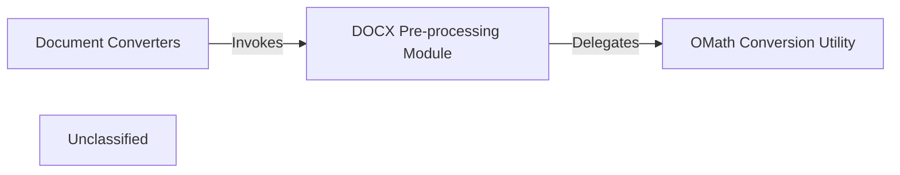

## Details

The DOCX conversion subsystem is initiated by the `Document Converters` component, specifically the `DocxConverter`. Upon receiving a DOCX file, the `DocxConverter` first passes the binary stream to the `DOCX Pre-processing Module`. This module is responsible for preparing the DOCX content by unzipping the file in memory, identifying specific XML files (e.g., `word/document.xml`), and then processing embedded Office Math Markup Language (OMath) equations. The `DOCX Pre-processing Module` delegates the actual translation of OMath expressions to LaTeX to the `OMath Conversion Utility`. After all OMath elements are converted to LaTeX and the DOCX content is updated, the pre-processed stream is returned to the `DocxConverter`, which then proceeds with the general conversion to HTML and subsequently to Markdown.

### DOCX Pre-processing Module
This module serves as the orchestrator for initial pre-conversion logic applied to DOCX files. Its core responsibility is to prepare the DOCX content by identifying and processing specific elements, such as embedded Office Math Markup Language (OMath) equations, to ensure they are in a suitable format for subsequent general conversion to Markdown. It acts as an entry point for all DOCX-specific preparatory steps.

**Related Classes/Methods**:

- <a href="https://github.com/microsoft/markitdown/blob/main/packages/markitdown/src/markitdown/converter_utils/docx/pre_process.py" target="_blank" rel="noopener noreferrer">`markitdown.converter_utils.docx.pre_process:pre_process_docx`</a>

### OMath Conversion Utility
A highly specialized utility component dedicated to the parsing and translation of Office Math Markup Language (OMath) expressions found within DOCX documents. Its sole purpose is to convert these OMath structures into a standardized LaTeX format, ensuring accurate representation of mathematical content across different rendering environments.

**Related Classes/Methods**:

- <a href="https://github.com/microsoft/markitdown/blob/main/packages/markitdown/src/markitdown/converter_utils/docx/math/omml.py" target="_blank" rel="noopener noreferrer">`markitdown.converter_utils.docx.math.omml:oMath2Latex`</a>

### Document Converters [[Expand]](./Document_Converters.md)
An external component that invokes the DOCX Pre-processing Module as a necessary preliminary step when processing DOCX files, depending on it to ensure DOCX content is correctly prepared and normalized before its general conversion process.

**Related Classes/Methods**:

- <a href="https://github.com/microsoft/markitdown/blob/main/packages/markitdown/src/markitdown/converters/_docx_converter.py" target="_blank" rel="noopener noreferrer">`markitdown.converters._docx_converter:DocxConverter`</a>

### Unclassified
Component for all unclassified files and utility functions (Utility functions/External Libraries/Dependencies)

**Related Classes/Methods**: _None_

### [FAQ](https://github.com/CodeBoarding/GeneratedOnBoardings/tree/main?tab=readme-ov-file#faq)