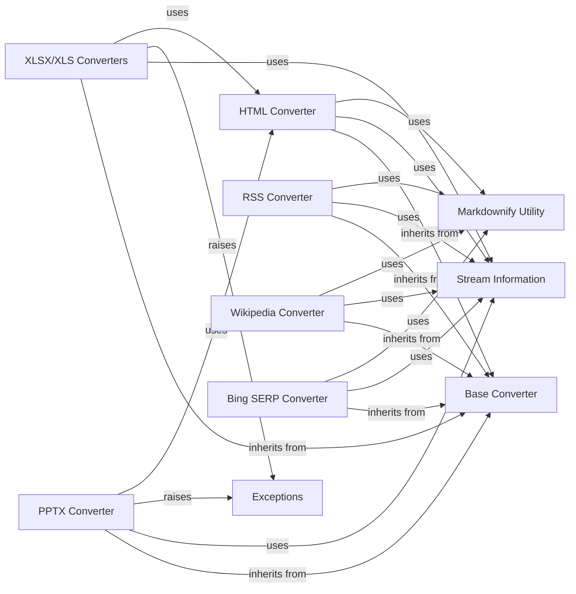

## Component Details

This subsystem focuses on converting various document formats into Markdown by first transforming them into an intermediate HTML representation, and then leveraging a robust HTML-to-Markdown conversion pipeline. The core principle is to standardize the conversion process through HTML, making it adaptable to diverse input types.

### Base Converter
Defines the foundational interface and common structures for all document converters. It includes the abstract `DocumentConverter` class and the `DocumentConverterResult` data structure, standardizing the output of conversion operations. All concrete converters inherit from this base class, ensuring a consistent API for document conversion.

**Related Classes/Methods**:

- <a href="https://github.com/microsoft/markitdown/blob/master/packages/markitdown/src/markitdown/_base_converter.py#L1-L1" target="_blank" rel="noopener noreferrer">`markitdown._base_converter` (1:1)</a>

### Stream Information
Manages and encapsulates metadata and details about the input data stream being processed by the converters, represented by the `StreamInfo` class. This information (e.g., mimetype, extension, URL) is crucial for converters to determine if they can handle a given input.

**Related Classes/Methods**:

- <a href="https://github.com/microsoft/markitdown/blob/master/packages/markitdown/src/markitdown/_stream_info.py#L1-L1" target="_blank" rel="noopener noreferrer">`markitdown._stream_info` (1:1)</a>

### Exceptions
Provides custom exception classes, notably `MissingDependencyException`, to handle specific error conditions such as missing external libraries required for certain conversions. This allows for graceful error handling when optional dependencies are not met.

**Related Classes/Methods**:

- <a href="https://github.com/microsoft/markitdown/blob/master/packages/markitdown/src/markitdown/_exceptions.py#L1-L1" target="_blank" rel="noopener noreferrer">`markitdown._exceptions` (1:1)</a>

### Markdownify Utility
Contains the `_CustomMarkdownify` class, a specialized utility for converting HTML content into Markdown. It extends an external `markdownify` library with custom rules for handling headings, links, and images, ensuring consistent and clean Markdown output. This is the core engine for HTML-to-Markdown transformation.

**Related Classes/Methods**:

- <a href="https://github.com/microsoft/markitdown/blob/master/packages/markitdown/src/markitdown/converters/_markdownify.py#L1-L1" target="_blank" rel="noopener noreferrer">`markitdown.converters._markdownify` (1:1)</a>

### HTML Converter
Dedicated to converting raw HTML input or HTML strings into Markdown. It heavily relies on the `_CustomMarkdownify` utility for its core conversion logic and serves as a crucial intermediate step for other converters that first transform their input into HTML.

**Related Classes/Methods**:

- <a href="https://github.com/microsoft/markitdown/blob/master/packages/markitdown/src/markitdown/converters/_html_converter.py#L1-L1" target="_blank" rel="noopener noreferrer">`markitdown.converters._html_converter` (1:1)</a>

### PPTX Converter
Handles the conversion of PowerPoint presentations (PPTX) to Markdown. This converter parses PPTX files, extracts text, images, and tables from slides. For tables, it generates HTML and then delegates the conversion to Markdown to the `HTML Converter`. It also includes logic for optional LLM-based image captioning.

**Related Classes/Methods**:

- <a href="https://github.com/microsoft/markitdown/blob/master/packages/markitdown/src/markitdown/converters/_pptx_converter.py#L1-L1" target="_blank" rel="noopener noreferrer">`markitdown.converters._pptx_converter` (1:1)</a>

### XLSX/XLS Converters
Manages the conversion of Excel spreadsheets (both XLSX and XLS formats) into Markdown. It reads data from individual sheets using `pandas`, converts each sheet into an HTML table, and then utilizes the `HTML Converter` to transform these tables into Markdown.

**Related Classes/Methods**:

- <a href="https://github.com/microsoft/markitdown/blob/master/packages/markitdown/src/markitdown/converters/_xlsx_converter.py#L1-L1" target="_blank" rel="noopener noreferrer">`markitdown.converters._xlsx_converter` (1:1)</a>

### RSS Converter
Converts RSS and Atom feeds into Markdown. It parses the feed's XML structure, extracts content from entries, and specifically uses `_CustomMarkdownify` to convert any embedded HTML content within these entries into Markdown.

**Related Classes/Methods**:

- <a href="https://github.com/microsoft/markitdown/blob/master/packages/markitdown/src/markitdown/converters/_rss_converter.py#L1-L1" target="_blank" rel="noopener noreferrer">`markitdown.converters._rss_converter` (1:1)</a>

### Wikipedia Converter
Converts content from Wikipedia pages into Markdown. It fetches the HTML of a Wikipedia page, performs specific cleanup (e.g., removing scripts and styles), and then processes the main content area using `_CustomMarkdownify` to generate Markdown.

**Related Classes/Methods**:

- <a href="https://github.com/microsoft/markitdown/blob/master/packages/markitdown/src/markitdown/converters/_wikipedia_converter.py#L1-L1" target="_blank" rel="noopener noreferrer">`markitdown.converters._wikipedia_converter` (1:1)</a>

### Bing SERP Converter
Converts search engine results pages (SERP) from Bing into Markdown. It parses the HTML structure of the SERP, extracts the algorithmic search results, handles URL decoding for redirects, and then converts the relevant HTML snippets into Markdown using `_CustomMarkdownify`.

**Related Classes/Methods**:

- <a href="https://github.com/microsoft/markitdown/blob/master/packages/markitdown/src/markitdown/converters/_bing_serp_converter.py#L1-L1" target="_blank" rel="noopener noreferrer">`markitdown.converters._bing_serp_converter` (1:1)</a>

### [FAQ](https://github.com/CodeBoarding/GeneratedOnBoardings/tree/main?tab=readme-ov-file#faq)