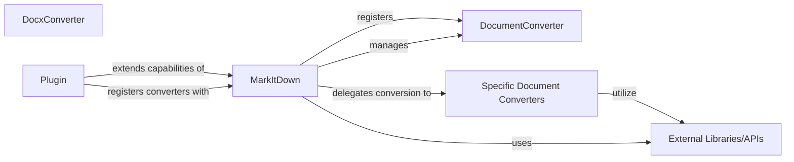

## Details

The `markitdown` project provides a robust document conversion subsystem, primarily centered around the `MarkItDown` facade. This facade orchestrates the conversion of various document types (local files, streams, URIs, HTTP responses) into a standardized markdown format. It achieves this by maintaining a registry of `DocumentConverter` implementations, each specialized in handling a specific input format. The system prioritizes converters based on their specificity, allowing for a flexible and extensible architecture where new document types can be supported by simply registering new `DocumentConverter` instances. External libraries are leveraged by individual converters for low-level parsing and content extraction, while a plugin mechanism allows for further customization of the conversion pipeline.

### MarkItDown
The primary facade of the `markitdown` library. It is responsible for delegating conversion tasks to the appropriate specific converter based on the input document type. It acts as the entry point for clients and orchestrates the conversion process, embodying the "Facade Pattern." It manages the registration and prioritization of `DocumentConverter` instances and handles the overall conversion workflow, including stream handling and error management.

**Related Classes/Methods**:

### DocumentConverter
The abstract interface (`markitdown.converters.DocumentConverter`) that all specific document converters must implement. It defines a consistent API for conversion, enabling the `MarkItDown` facade to interact uniformly with different format handlers. This is fundamental for the "Plugin Architecture" and "Facade Pattern." Implementations must provide `accepts` and `convert` methods.

**Related Classes/Methods**:

### Specific Document Converters [[Expand]](./Specific_Document_Converters.md)
A logical collection of concrete implementations of the `DocumentConverter` interface, each specialized in transforming a particular input document format (e.g., DOCX, HTML, PDF, images, web content) into markdown. This component represents the overall capability of format-specific conversion. Examples include `DocxConverter`, `HtmlConverter`, `PdfConverter`, etc.

**Related Classes/Methods**:

### DocxConverter
A concrete implementation of the `DocumentConverter` interface, specifically designed to transform DOCX documents into standardized markdown output. Its responsibilities include content extraction, parsing, and markdown formatting, likely utilizing external libraries for DOCX file manipulation. It serves as a representative example of the specialized converters within the subsystem.

**Related Classes/Methods**:

### External Libraries/APIs
Third-party libraries or external APIs (e.g., `requests`, `magika`, `python-docx`, Azure Document Intelligence) that specific converters and the `MarkItDown` facade utilize for low-level parsing, content extraction, file type identification, or advanced document processing. These are crucial dependencies for the converters' functionality and the overall system's ability to handle diverse input types.

**Related Classes/Methods**:

### Plugin
Represents the mechanism for extending the `markitdown` library's conversion capabilities through external plugins. This component aligns with the "Plugin Architecture," allowing for extensible and customizable conversion workflows by enabling the registration of additional `DocumentConverter` instances at runtime.

**Related Classes/Methods**:

- <a href="https://github.com/microsoft/markitdown/blob/main/packages/markitdown/src/markitdown/_markitdown.py#L65-L82" target="_blank" rel="noopener noreferrer">`markitdown._markitdown._load_plugins`:65-82</a>

### [FAQ](https://github.com/CodeBoarding/GeneratedOnBoardings/tree/main?tab=readme-ov-file#faq)