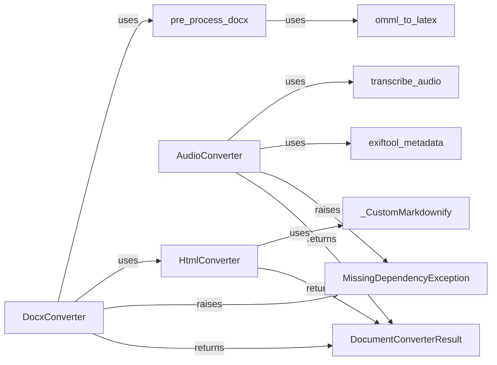

## Component Details

This subsystem is a collection of specialized document converters, each designed to transform a particular document format into Markdown. These converters adhere to a common interface, enabling the MarkItDown Core Engine to dynamically select and invoke the appropriate converter based on the input document's type.

### HtmlConverter
The base converter for HTML content. It parses HTML, removes scripts and styles, and converts the remaining content into Markdown. Many other converters internally convert their input to HTML before leveraging this component for the final Markdown transformation.

**Related Classes/Methods**:

- `HtmlConverter` (0:0)

### DocxConverter
Specializes in converting DOCX files to Markdown, preserving style information and tables. It relies on external libraries and internal utilities for pre-processing and then delegates the HTML conversion to the `HtmlConverter`.

**Related Classes/Methods**:

- `DocxConverter` (0:0)

### AudioConverter
Converts audio files into Markdown by extracting metadata (if Exiftool is available) and transcribing speech to text (if speech recognition dependencies are met).

**Related Classes/Methods**:

- `AudioConverter` (0:0)

### DocumentConverterResult
A standardized data structure that encapsulates the output of any document conversion operation. It primarily holds the converted Markdown content and can optionally include a document title.

**Related Classes/Methods**:

- `DocumentConverterResult` (0:0)

### MissingDependencyException
A custom exception raised when a converter requires an optional external dependency that is not installed. This allows for graceful degradation and informs the user about missing requirements without crashing the application.

**Related Classes/Methods**:

- `MissingDependencyException` (0:0)

### _CustomMarkdownify
A utility class (likely a wrapper or customization of an external markdownify library) responsible for the actual conversion of HTML content into Markdown. It's a key internal dependency for the `HtmlConverter` and, by extension, many other converters.

**Related Classes/Methods**:

- `_CustomMarkdownify` (0:0)

### pre_process_docx
A set of functions specifically designed to pre-process DOCX content before it's converted to HTML. This includes handling complex elements like mathematical equations to ensure accurate conversion.

**Related Classes/Methods**:

- `pre_process_docx` (0:0)

### omml_to_latex
A specialized utility that converts Office Math Markup Language (OMML), found in DOCX files, into LaTeX format. This is crucial for correctly rendering mathematical equations in the final Markdown output.

**Related Classes/Methods**:

- `omml_to_latex` (0:0)

### exiftool_metadata
A utility function that interacts with the external Exiftool application to extract rich metadata from various media files. This metadata can then be incorporated into the Markdown output.

**Related Classes/Methods**:

- `exiftool_metadata` (0:0)

### transcribe_audio
A utility function responsible for converting audio content into text using speech recognition. It's a core dependency for the `AudioConverter`.

**Related Classes/Methods**:

- `transcribe_audio` (0:0)

### [FAQ](https://github.com/CodeBoarding/GeneratedOnBoardings/tree/main?tab=readme-ov-file#faq)